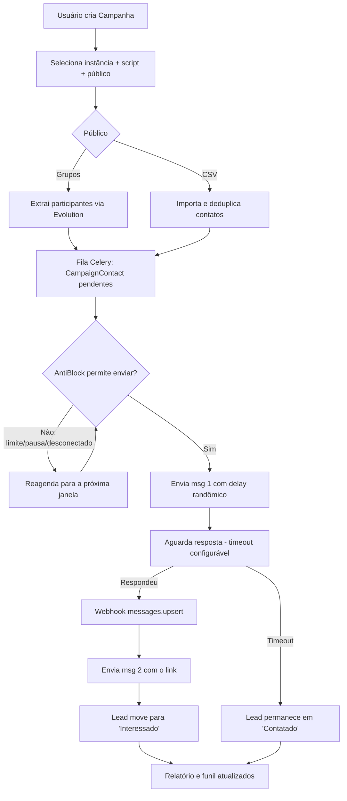
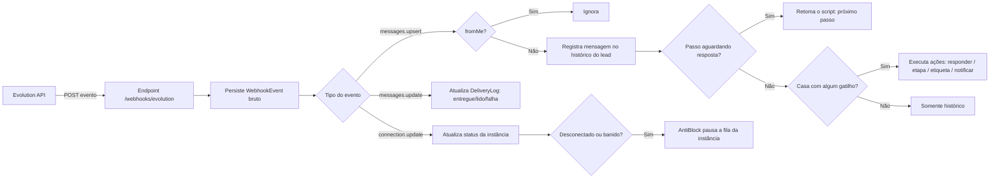
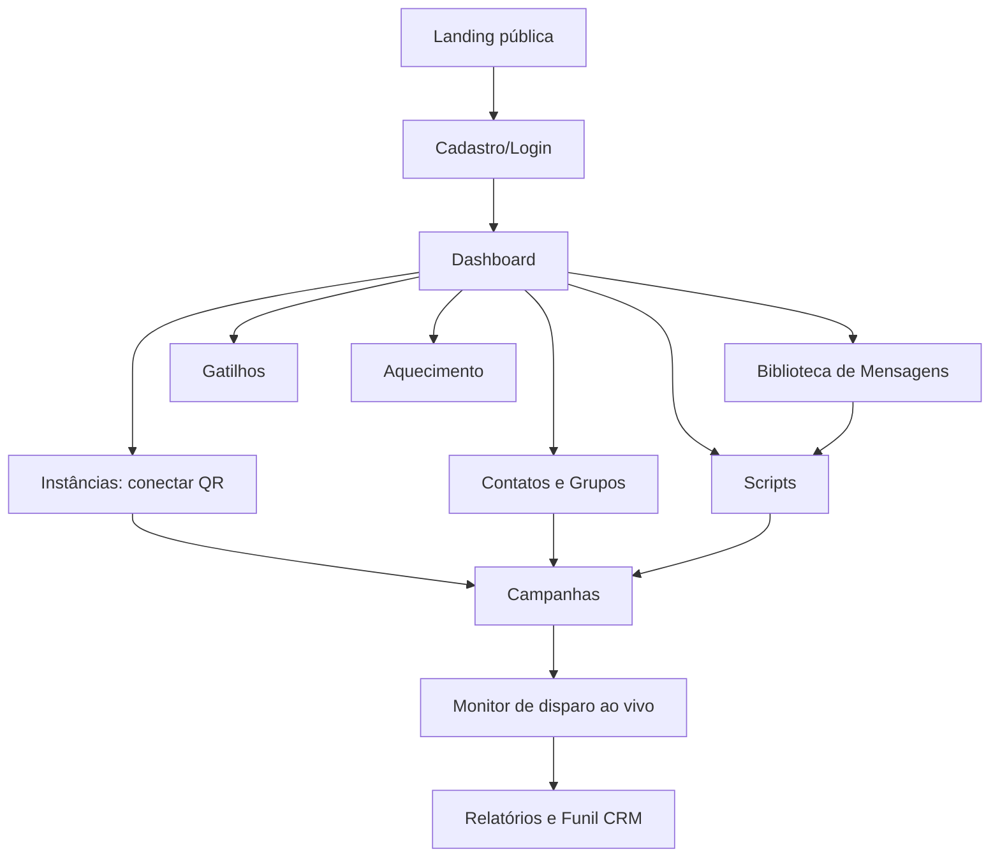
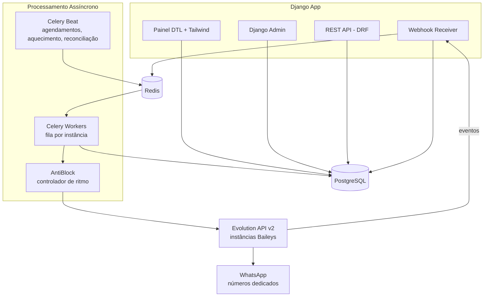
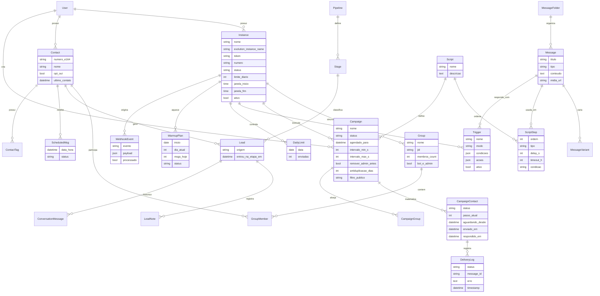

# PRD — Sparzap ⚡
### Plataforma de Automação de Vendas e Divulgação no WhatsApp

> **Produto:** Sparzap — automação de disparos, gatilhos e CRM no WhatsApp
> **Inspiração:** Revzap (revzap.com.br) — features mapeadas do site oficial + vídeo 3
> **Stack:** Django 5 + Evolution API v2 (Baileys) + Celery/Redis + PostgreSQL + TailwindCSS
> **Autor:** TechTeo (Renato Teodoro)
> **Status:** Em desenvolvimento — v0.5 (scaffold Django ativo; sprints 0–19 planejadas; 122+ testes)
> **Data:** 2026-08-15

---

## Índice

1. [Visão Geral](#1-visão-geral)
2. [Sobre o Produto](#2-sobre-o-produto)
3. [Propósito](#3-propósito)
4. [Público-Alvo](#4-público-alvo)
5. [Objetivos](#5-objetivos)
6. [Requisitos Funcionais](#6-requisitos-funcionais)
7. [Requisitos Não-Funcionais](#7-requisitos-não-funcionais)
8. [Arquitetura Técnica](#8-arquitetura-técnica)
9. [Design System](#9-design-system)
10. [User Stories](#10-user-stories)
11. [Métricas de Sucesso](#11-métricas-de-sucesso)
12. [Riscos e Mitigações](#12-riscos-e-mitigações)
13. [Lista de Tarefas (Sprints)](#13-lista-de-tarefas-sprints)
14. [Roadmap Pós-v1](#14-roadmap-pós-v1)
15. [Apêndices](#apêndice-a--glossário)

---

## 1. Visão Geral

O **Sparzap** é uma aplicação web que automatiza divulgação e vendas no WhatsApp:
disparo em massa com protocolo anti-banimento, scripts de duas ou mais mensagens
com gatilho por resposta, respostas automáticas por palavra-chave, CRM de leads
por etapas e aquecimento de números.

Diferente das ferramentas do mercado (extensões de Chrome acopladas ao WhatsApp
Web), o Sparzap roda em **servidor próprio 24/7** usando a **Evolution API**
(Baileys) como camada de transporte, com controle de ritmo centralizado na
própria aplicação.

| Item | Definição |
|---|---|
| **Nome** | Sparzap |
| **Tipo** | Aplicação web (uso interno na v1 → SaaS na v3) |
| **Stack** | Django 5, DRF, Celery, Redis, PostgreSQL, TailwindCSS, Evolution API v2.3.7 |
| **Idioma** | Português Brasileiro (100% da interface) |
| **Deploy alvo** | VPS Ubuntu com Docker (Evolution API já em execução na porta 8080) |

---

## 2. Sobre o Produto

### 2.1 Domínios do Sistema (Apps Django)

| App | Responsabilidade |
|---|---|
| `core` | `BaseModel` abstrato, landing pública, layout base, dashboard |
| `accounts` | Usuário customizado (login por e-mail), perfil, permissões |
| `instances` | Instâncias/números da Evolution API, QR, status, cliente HTTP |
| `webhooks` | Receptor de eventos da Evolution (`messages.upsert`, `connection.update`, …) |
| `contacts` | Contatos, grupos, etiquetas, importação CSV e exportação |
| `library` | Biblioteca de mensagens rápidas (texto, áudio, imagem, vídeo, documento) |
| `scripts` | Scripts automáticos (passos, delays, aguardar resposta, condições) |
| `campaigns` | Campanhas de disparo em massa, público, fila, logs de entrega |
| `antiblock` | Controlador de ritmo: limites, pausas, randomizador, aquecimento |
| `triggers` | Gatilhos por palavra-chave e mensagens agendadas individuais |
| `crm` | Pipelines, etapas, leads, funil kanban, histórico de conversas |
| `reports` | Relatórios de campanha, funil e exportações |
| `api` | REST API (DRF) para integrações |

### 2.2 Convenções de Projeto

- **Service layer obrigatório**: regra de negócio em `services.py` de cada app; views só orquestram.
- **Todo model herda de `core.BaseModel`** (`created_at`, `updated_at`).
- **Nenhum envio direto**: 100% dos envios passam pelo controlador de ritmo (`antiblock`).
- **Class-Based Views** + `LoginRequiredMixin` como padrão nas páginas internas.
- **Segredos via `python-decouple`** (`.env` + `.env.example`); nada hardcoded.
- Interface e mensagens de erro em **Português Brasileiro**.

---

## 3. Propósito

### 3.1 Problema

Divulgar ofertas e produtos em massa no WhatsApp manualmente é lento, sujeito a
erro humano e a banimento por spam. As ferramentas existentes (ex.: Revzap) são
extensões de Chrome acopladas ao WhatsApp Web — frágeis, presas a uma conta e a
um computador ligado, com assinatura mensal por máquina e dependência total de
terceiros.

### 3.2 Solução

Aplicação web própria que automatiza:

- **Disparo em massa** com protocolo anti-banimento (intervalos dinâmicos, limites diários, pausa noturna)
- **Scripts de 2+ mensagens** com gatilho por resposta (msg 1 induz resposta → msg 2 entrega o link)
- **Gatilhos inteligentes** (resposta automática por palavra-chave)
- **Etapas/CRM** do lead (novo → contatado → respondeu → interessado → vendido/perdido)
- **Mensagens rápidas** (texto, áudio, mídia, documento) com variáveis
- **Organização** por pastas, menção em grupos, exportação de contatos
- **Múltiplos números** simultâneos via instâncias da Evolution API

### 3.3 Não-Objetivos (fora de escopo)

- Não é um cliente de WhatsApp completo (não substitui o app oficial para conversas manuais longas).
- Não faz scraping de números de desconhecidos fora dos grupos em que o número participa.
- Não burla limites do WhatsApp: o objetivo do AntiBlock é **operar dentro de um ritmo humano**, não mascarar spam.
- Não implementa telefonia/chamadas de voz ou vídeo.
- Multi-tenant, billing e app mobile nativo ficam fora da v1 (ver seção 14).

### 3.4 Diferenciais vs Revzap

| Revzap | Sparzap |
|---|---|
| Extensão Chrome (WhatsApp Web) | **Servidor próprio** (Evolution API/Baileys) — roda 24/7 sem browser aberto |
| Conta pessoal em risco | **Números dedicados** por instância (chips separados) |
| Assinatura paga por máquina | Custo só de infra (VPS + chips) |
| Funciona só com browser aberto | API + fila + agendamento nativo |
| Black-box | Código próprio, extensível, integrável (ex.: pipeline Promo) |

### 3.5 Análise de Concorrência — Total Chat (diretos e indiretos)

> **Fonte:** site oficial (totalchat.com.br), Instagram @totalchatoficial, comparativos públicos (15/08/2026).
> **Análise completa:** `~/life/Trabalho/Projetos/sparzap-concorrente-totalchat.md`

#### O concorrente (perfil)

| Item | Total Chat |
|---|---|
| Empresa | Newee Soluções em Tecnologia LTDA |
| Origem | **Florianópolis/SC** (mercado local do TechTeo!) |
| Canal | WhatsApp + Instagram (omnichannel) |
| Conexão | API Oficial Meta **e** QR Code (Baileys) |
| Modelo | SaaS (não self-hosted) |

#### Preços (o ponto fraco dele — oportunidade do Sparzap)

| Item | Total Chat | Sparzap (self-hosted) |
|---|---|---|
| Plano Profissional | **R$ 349,90/mês** (promo R$ 179,90) | Custo da VPS + chip (~R$ 30–50/mês) |
| Usuário adicional | R$ 65,00 | Ilimitado (mesmo plano) |
| Campanhas em massa | Créditos **comprados à parte** | Ilimitado (Evolution/Baileys) |
| IA (ChatGPT) | Inclusa | LLM próprio (GLM/Luna via opencode) |
| Trial | 5 dias | Teste ilimitado (é seu) |

#### Funcionalidades dele que o Sparzap deve ter (ou já tem)

| Funcionalidade | Total Chat | Sparzap |
|---|---|---|
| Multiatendimento (1 número, N operadores) | ✅ | 🔲 **v2 — caixa de entrada humana** (sinergia com F1/F4) |
| Chatbot com IA | ✅ ChatGPT | 🔲 F1 (respondedor IA + fallback humano) |
| Chatbot de fluxo | ✅ | ✅ RF-29/30 (scripts com passos) |
| CRM Kanban | ✅ | ✅ RF-56/58 (pipeline + kanban) |
| Mensagem de ausência/encerramento | ✅ | 🔲 **v1 — adicionar como mensagens da biblioteca com horário** |
| Múltiplos números | ✅ | ✅ RF-01/05 (instâncias) |
| Omnichannel Instagram | ✅ | 🔲 F5 (API pública) — avaliar Direct IG no futuro |
| API aberta | ✅ | ✅ RF-80/84 (DRF) |
| Integração Trello/Calendar | ✅ | 🔲 v2 (avaliar webhooks/API aberta cobre) |

#### Conclusão estratégica

1. **Preço é a maior vantagem do Sparzap**: 5–10× mais barato que o Total Chat no mesmo nicho (PMEs).
2. **Diferenciação por automação**: Total Chat é ferramenta de *atendimento*; Sparzap é ferramenta de *disparo + funil + CRM* — o fluxo do vídeo 3 (2 passos) não é o core dele.
3. **Mercado local**: ambos em Florianópolis — o Sparzap pode atacar PMEs locais com preço e automação.
4. **Não copiar**: campanha com créditos pagos à parte (custo escondido) é anti-padrão — Sparzap mantém ilimitado.
5. **Atenção ao ban**: Total Chat opera com API oficial Meta E QR Code — o Sparzap (Baileys não oficial) precisa do AntiBlock forte (já desenhado, RF-63/70).

---

## 4. Público-Alvo

| Persona | Perfil | Caso de uso |
|---|---|---|
| **Afiliado** (Renato / Promo Galáxias) | Divulga ofertas com link de afiliado | Disparar convites de grupo + ofertas com protocolo seguro |
| **Pequeno vendedor** | Loja/revenda com WhatsApp como canal principal | Nutrir leads, responder automaticamente, CRM simples |
| **Prestador de serviços** (TechTeo) | Atendimento e orçamento por WhatsApp | Atendimento + follow-up automático |
| **Cliente SaaS** (futuro) | Empresa que quer o produto pronto | Multi-tenant com planos e equipe |

**Caso de uso primário (v1) — fluxo do vídeo 3:** entrar em grupos de
concorrentes → extrair participantes → disparo em 2 passos (msg 1 induz resposta
→ msg 2 entrega o link) → membros entram no grupo de ofertas próprio.

---

## 5. Objetivos

### 5.1 Objetivos Principais

| # | Objetivo | Resultado esperado |
|---|---|---|
| O1 | Automatizar o fluxo de captação em 2 passos | Executar o funil do vídeo 3 sem operação manual |
| O2 | Operar sem banimento | Zero números banidos com os limites padrão |
| O3 | Centralizar o controle de ritmo | 100% dos envios passando pelo `antiblock` |
| O4 | Dar visibilidade do funil | Painel com envios, respostas e conversão por etapa |
| O5 | Operar múltiplos chips de uma tela | N instâncias ativas simultâneas sem troca de contexto |
| O6 | Ser extensível | REST API + integração com o ecossistema TechTeo |

### 5.2 Objetivos Secundários

- Reduzir o tempo de montagem de uma campanha para menos de 5 minutos.
- Permitir copiar toda a configuração entre instâncias/máquinas ("crie uma vez, use em várias").
- Manter contatos e conversas em base própria (PostgreSQL), sem dependência de SaaS.

---

## 6. Requisitos Funcionais

### 6.1 Instâncias / Números (`instances`)

- **RF-01** CRUD de instâncias da Evolution (nome, token, número, descrição).
- **RF-02** Pareamento por **QR Code** exibido no painel (polling do status até conectar).
- **RF-03** Status por instância: `conectado`, `desconectado`, `aguardando QR`, `banido`.
- **RF-04** **Limite de envio diário** configurável por número (padrão 30 na v1).
- **RF-05** Janela de operação por instância (pausa noturna, ex.: 22h–07h).
- **RF-06** Ativar/desativar instância (instância inativa não recebe envios).
- **RF-07** Registro automático do webhook na Evolution ao criar a instância.
- **RF-08** Teste de conexão ("enviar mensagem de teste para meu próprio número").

### 6.2 Webhook de Eventos (`webhooks`)

- **RF-09** Endpoint público autenticado por token/segredo para receber eventos da Evolution.
- **RF-10** Persistir o evento bruto (`WebhookEvent`) antes de processar — auditoria e reprocessamento.
- **RF-11** Processar `messages.upsert` (mensagem recebida), `messages.update` (status de entrega),
  `connection.update` (estado da instância) e `contacts.upsert`.
- **RF-12** Ignorar mensagens originadas pelo próprio bot (`fromMe`) nos gatilhos.
- **RF-13** Idempotência por `message_id` (evento repetido não duplica efeito).
- **RF-14** **Reconciliação periódica**: rotina que consulta conversas para recuperar webhooks perdidos.

### 6.3 Contatos e Grupos (`contacts`)

- **RF-15** Importação de contatos por **CSV** (com mapeamento de colunas e prévia).
- **RF-16** **Extração de participantes** de grupos via Evolution (`fetchAllParticipants`).
- **RF-17** Sincronização da lista de grupos da instância.
- **RF-18** **Deduplicação por número** (normalização E.164 + DDI/DDD brasileiro e 9º dígito).
- **RF-19** Etiquetas (multi-etiqueta) por contato.
- **RF-20** Exportação CSV com etiquetas e etapa atual.
- **RF-21** Organização por pastas/listas de público.
- **RF-22** Marcação de opt-out ("não perturbe") — contato bloqueado para qualquer disparo.

### 6.4 Biblioteca de Mensagens (`library`)

- **RF-23** CRUD de mensagens: **texto, áudio, imagem, vídeo, documento**.
- **RF-24** Variáveis de personalização: `{{nome}}`, `{{grupo}}`, `{{link}}`, `{{empresa}}`.
- **RF-25** Pastas/categorias de organização.
- **RF-26** **Variações de texto (spintax)**: N versões do mesmo texto, sorteadas por envio (anti-padrão).
- **RF-27** Prévia renderizada com dados de exemplo antes de salvar.
- **RF-28** Upload de mídia com validação de tipo e tamanho.

### 6.5 Scripts Automáticos (`scripts`)

- **RF-29** Script = sequência ordenada de passos.
- **RF-30** Tipos de passo: `mensagem`, `delay`, `aguardar_resposta`, `condição`, `mudar_etapa`.
- **RF-31** Passo `aguardar_resposta` com timeout configurável (ex.: 48h) e ação de fallback.
- **RF-32** Condição simples: "se a resposta contiver X → ir para o passo Y".
- **RF-33** Editor visual simples (lista ordenada, arrastar para reordenar).
- **RF-34** **Modo teste**: executar o script para um único contato.
- **RF-35** Duplicar script.

### 6.6 Disparo em Massa (`campaigns`)

- **RF-36** Criar campanha selecionando: instância + script + público (grupos ou contatos).
- **RF-37** **Intervalo dinâmico** entre mensagens (mín./máx. em segundos, randomizado).
- **RF-38** Limite diário por número + pausa noturna aplicados automaticamente.
- **RF-39** Agendamento (data/hora de início).
- **RF-40** Controles de execução: iniciar, pausar, retomar, cancelar.
- **RF-41** Progresso em tempo real e relatório final (enviadas, entregues, lidas, respondidas, falhas).
- **RF-42** **Modo grupos**: disparo para os membros extraídos dos grupos selecionados.
- **RF-43** **Disparo seletivo**: filtrar "só quem NÃO respondeu" ou "somente leads na etapa X".
- **RF-44** **Anti-duplicação por lead**: não reenviar a mesma campanha/oferta ao mesmo lead
  dentro de N dias (configurável; padrão 30).
- **RF-45** **Importar/exportar campanhas entre instâncias** (scripts, mensagens e campanhas).
- **RF-46** **Backup/restauração** completa da configuração em JSON.
- **RF-47** Idempotência por `(campanha, contato)` — retry não gera envio duplicado.
- **RF-48** **Ação pré-disparo em grupos: "Remover Admin" (auto-demote)** — ver 6.6.1.

#### 6.6.1 Auto-Demote (Remover Admin) — detalhamento

Ao disparar em grupos de terceiros (estratégia do vídeo 3), o número do bot pode
ter sido promovido a admin sem intenção. Antes do disparo o sistema oferece
remover o próprio admin (`POST /group/updateParticipant` com `action=demote`) para:

1. Não chamar atenção (bot admin em grupo alheio é suspeito → risco de remoção/ban).
2. Evitar mensagens com permissões de admin (ex.: menção a todos sem querer).
3. Padronizar o perfil de "membro comum" em todos os grupos-alvo.

- **Modo automático**: checkbox "remover admin antes do disparo" por campanha.
- **Modo manual**: botão por grupo na listagem, com confirmação.
- **Log da ação**: quando removeu, qual grupo, qual instância, resultado.

### 6.7 Gatilhos Inteligentes (`triggers`)

- **RF-49** Regra: palavra-chave (ex.: "quero", "grupo", "link", "preço") → resposta automática da biblioteca.
- **RF-50** Escopo da regra: por instância, opcionalmente restrita a grupo ou contato.
- **RF-51** Processamento via webhook (`messages.upsert`), ignorando mensagens do próprio bot.
- **RF-52** **Gatilho avançado**: múltiplas palavras/condições por regra (E/OU) e múltiplas ações
  (responder + mudar etapa + notificar + etiquetar).
- **RF-53** **Gatilho por horário**: mensagem individual agendada para um lead em data/hora específica
  (ex.: follow-up amanhã às 14h) — distinto do disparo em massa agendado.
- **RF-54** Prioridade/ordem de avaliação entre regras e limite anti-loop (não responder 2× em N minutos).
- **RF-55** **Resposta com IA (chatbot contextual)** *(v2)*: LLM responde perguntas abertas;
  se não souber → alerta humano no painel + lead entra na fila de atendimento.
- **RF-55a** **Mensagem de ausência/encerramento** *(inspirado no Total Chat)*: mensagem automática
  da biblioteca disparada fora do horário comercial (ex.: "Olá! Estamos fora do horário...") e
  mensagem de encerramento ao fim do expediente; configuração por instância com janela de horário.

### 6.8 CRM / Etapas (`crm`)

- **RF-56** Pipeline configurável (padrão: `Novo → Contatado → Respondeu → Interessado → Vendido/Perdido`).
- **RF-57** Mudança de etapa manual no painel ou automática por gatilho/script.
- **RF-58** **Funil visual (kanban)** com arrastar-e-soltar entre etapas.
- **RF-59** **Taxa de conversão por etapa** por campanha (relatório de funil).
- **RF-60** Histórico de conversas por contato (mensagens enviadas e recebidas).
- **RF-61** Anotações e etiquetas por lead.
- **RF-62** Exportação CSV dos leads com etapa e origem (campanha/grupo).

### 6.9 AntiBlock (`antiblock`)

- **RF-63** **Randomizador**: delay entre envios sempre variável (nunca fixo).
- **RF-64** **Delay dinâmico**: intervalo aumenta progressivamente ao detectar falhas/restrição.
- **RF-65** **Limite diário** por número (ex.: 30/50/100 — configurável).
- **RF-66** **Pausa noturna** configurável (ex.: 22h–07h sem envio).
- **RF-67** **Aquecimento de número**: rotina gradual (dia 1: 5 msgs, dia 2: 10…) antes de liberar disparos grandes.
- **RF-68** **Monitor de restrição**: rate limit ou desconexão reportada pela Evolution → pausa automática da fila.
- **RF-69** Bloqueio preventivo: instância desconectada ou banida não recebe tarefas.
- **RF-70** Telemetria do ritmo: envios por hora/dia por instância, exposta no painel.

### 6.10 Aquecedor de Número (RevProtect-like)

- **RF-71** Rotina de "vida normal": mensagens para contatos próprios, participação em grupos,
  variação de horários — simula comportamento humano.
- **RF-72** Atividade mínima diária para o número não parecer ocioso/robô.
- **RF-73** Plano de aquecimento por instância com progressão em dias e conclusão automática.
- **RF-74** *(v2)* **Persona de horário**: aprender o padrão real de uso e replicá-lo.

### 6.11 Painel e Relatórios (`core`, `reports`)

- **RF-75** Visão geral: instâncias conectadas, envios hoje, taxa de resposta, leads por etapa.
- **RF-76** Gráficos: envios por dia, conversão por campanha, funil por etapa.
- **RF-77** **Contadores ao vivo** durante disparos (SSE na v1; WebSocket se necessário).
- **RF-78** Relatório por campanha exportável (CSV).
- **RF-79** Log de entregas consultável e filtrável (status, erro, instância, período).

### 6.12 REST API (`api`)

- **RF-80** Autenticação por token; escopo por usuário.
- **RF-81** Endpoints de leitura: instâncias, campanhas, leads, relatórios.
- **RF-82** Endpoints de escrita: criar contato, agendar mensagem individual, disparar campanha existente.
- **RF-83** Rate limiting por token.
- **RF-84** Documentação automática (drf-spectacular / Swagger).

### 6.13 Fluxos de UX (Mermaid)

#### Fluxo do disparo em 2 passos (caso de uso primário)



#### Fluxo do webhook e gatilhos



#### Fluxo de navegação do usuário



---

## 7. Requisitos Não-Funcionais

| # | Área | Requisito |
|---|---|---|
| RNF-01 | **Segurança** | Autenticação Django por e-mail; 2FA opcional; API por token; segredos em `.env`; webhook com segredo |
| RNF-02 | **Segurança** | Isolamento por usuário: todo queryset filtrado pelo dono (`request.user`) |
| RNF-03 | **Confiabilidade** | Celery com retry exponencial + dead-letter; idempotência de envio por `(campanha, contato)` |
| RNF-04 | **Anti-ban** | Nenhum envio direto à Evolution: 100% via controlador de ritmo |
| RNF-05 | **Escalabilidade** | Multi-instância Evolution; workers Celery horizontais; fila por instância |
| RNF-06 | **Desempenho** | Painel carrega em < 2s com 50k contatos; listagens paginadas e indexadas |
| RNF-07 | **Observabilidade** | Logs estruturados, métricas de envio, alerta de instância desconectada |
| RNF-08 | **Auditoria** | Evento bruto do webhook e log de entrega preservados para reprocessamento |
| RNF-09 | **Usabilidade** | 100% da interface em Português Brasileiro; responsivo (mobile/desktop); tema claro e escuro |
| RNF-10 | **Acessibilidade** | Contraste WCAG AA; navegação por teclado nos formulários principais |
| RNF-11 | **Portabilidade** | Docker Compose reproduzindo produção; backup/restauração em JSON |
| RNF-12 | **Custo** | Rodar na VPS atual (1.8 GB RAM + swap 4 GB) junto à Evolution API |
| RNF-13 | **Conformidade** | Opt-out respeitado em todos os disparos; dados do lead exportáveis e removíveis (LGPD) |
| RNF-14 | **Multi-tenant** | *(v3)* separação por workspace/plano |

---

## 8. Arquitetura Técnica

### 8.1 Stack

| Camada | Tecnologia | Observação |
|---|---|---|
| Backend | Django 5.x | Apps por domínio + service layer |
| API | Django REST Framework | Token auth + drf-spectacular |
| Fila/Agenda | Celery + Redis + Celery Beat | Fila por instância; beat para agendamentos e aquecimento |
| Banco | PostgreSQL 16 | Já disponível no host da Evolution |
| Canal WhatsApp | Evolution API v2.3.7 (Docker, porta 8080) | Baileys; multi-instância; webhooks |
| Frontend | Django Template Language + TailwindCSS | HTMX para interações parciais; SSE para tempo real; tokens do design system MongoDB-inspired (`mongodb/design-system-*.html`, seção 9) |
| Gráficos | Chart.js | Envios/dia, funil, conversão |
| Config | python-decouple | `.env` + `.env.example` |
| Deploy | Docker Compose + Nginx + Gunicorn | VPS Ubuntu |

### 8.2 Visão de Componentes



### 8.3 Fluxo de um Disparo

1. Usuário cria **Campanha** (título, instância, script, público, intervalos).
2. Usuário seleciona o **público** (grupos importados ou contatos importados), com filtros de
   disparo seletivo e anti-duplicação aplicados na materialização.
3. A campanha materializa `CampaignContact` pendentes e entra na **fila** (Celery).
4. O worker consulta o **AntiBlock** antes de cada envio: limite diário, janela de operação,
   status da instância e delay randômico.
5. O script executa: msg 1 → aguarda resposta (webhook) → msg 2 (ou fallback no timeout).
6. O estado do lead é atualizado no **CRM** e refletido no painel em tempo real.

### 8.4 Modelo de Dados (ERD Mermaid)



> Entidades de fases futuras (não modeladas na v1): `ABTest` (variantes A/B),
> `Commission` (comissão por lead do funil de ofertas), `Backup` (snapshots JSON),
> `Workspace` (multi-tenant).

### 8.5 Integração com a Evolution API

Base: `http://localhost:8080` · Header: `apikey: <AUTHENTICATION_API_KEY>`

| Ação | Endpoint |
|---|---|
| Criar instância | `POST /instance/create` `{instanceName}` |
| Conectar (QR) | `GET /instance/connect/{name}?number=` |
| Status | `GET /instance/connectionState/{name}` |
| Enviar texto | `POST /message/sendText/{name}` `{number, text}` |
| Enviar mídia | `POST /message/sendMedia/{name}` |
| Enviar áudio | `POST /message/sendWhatsAppAudio/{name}` |
| Mencionar | `POST /group/sendMention/{name}` (menciona todos) |
| Participantes do grupo | `GET /group/fetchAllParticipants/{name}/{groupJid}` |
| Listar grupos | `GET /group/fetchAllGroups/{name}` |
| **Promover/Remover admin** | `POST /group/updateParticipant/{name}` `{groupJid, participants: [jid], action: promote\|demote}` — só admin do grupo; usamos `demote` para o auto-demote do bot |
| Enviar para grupo | `POST /message/sendText/{name}` `{number: groupJid}` |
| Webhook eventos | `POST /webhook/set/{name}` `{webhook: {url, events: [...]}}` |
| Eventos relevantes | `messages.upsert`, `messages.update`, `connection.update`, `contacts.upsert` |

> ⚠️ **Nota importante:** a Evolution API é apenas a camada de transporte. Todo o
> controle de ritmo/anti-ban fica na nossa aplicação — nunca confiar na API para limitar.

**Contrato do cliente HTTP (`instances/evolution.py`):** timeout curto (10s), retry com backoff
para erros 5xx/timeout, sem retry em 4xx, log estruturado de cada chamada
(instância, endpoint, status, latência) e exceções tipadas
(`EvolutionUnavailable`, `EvolutionRateLimited`, `EvolutionAuthError`).

### 8.6 Estrutura de Diretórios (alvo)

```text
sparzap/
├── core/                 # settings, urls, BaseModel, landing, dashboard
├── accounts/
├── instances/            # models, services, evolution.py (cliente HTTP)
├── webhooks/
├── contacts/
├── library/
├── scripts/
├── campaigns/            # models, services, tasks.py (Celery)
├── antiblock/            # rate controller + warmup
├── triggers/
├── crm/
├── reports/
├── api/
├── templates/            # base.html, components/, por app
├── static/
├── deploy/               # docker-compose.prod.yml, nginx, update.sh
├── docs/
├── .env.example
├── requirements.txt
├── PRD.md
└── README.md
```

---

## 9. Design System

**Fonte da verdade:** [`mongodb/design-system-light.html`](mongodb/design-system-light.html) e
[`mongodb/design-system-dark.html`](mongodb/design-system-dark.html) — catálogo de tokens
gerado a partir de um `DESIGN.md` inspirado na identidade visual da MongoDB
([getdesign.md](https://getdesign.md/design-md/mongodb/preview)). Toda cor, fonte,
componente e espaçamento do Sparzap deriva desses dois arquivos; eles são a
referência visual canônica — este PRD só documenta como aplicá-los ao produto.

Identidade: base **Forest** (verde-petróleo quase preto) com acento **MongoDB
Green** neon, tipografia serifada (`DM Serif Display`) em destaques editoriais,
`Inter` no corpo da interface e `Source Code Pro` em rótulos técnicos/código —
JIDs, payloads de webhook, trechos de mensagem.

### 9.1 Paleta e Tokens

**Cores de marca** (fixas nos dois temas):

| Token CSS | Hex | Papel |
|---|---|---|
| `--forest` | `#001e2b` | Fundo escuro profundo — hero, navbar, seções de destaque (`.section-dark`) |
| `--green` | `#00ed64` | Acento de marca — labels de seção, spans de destaque, sucesso |
| `--dark-green` | `#00684a` | Botões primários (`.btn-green`), links, CTA |
| `--blue` | `#006cfa` | Foco de formulário, links secundários, elementos interativos |

**Tokens que trocam de valor por tema** (`--white`/`--black` representam
*fundo*/*texto*, não literalmente branco e preto):

| Token CSS | Modo escuro | Modo claro | Papel |
|---|---|---|---|
| `--white` (fundo) | `#001e2b` | `#ffffff` | Fundo da página e dos cards |
| `--black` (texto) | `#e8edeb` | `#000000` | Texto principal |
| `--teal` | `#1c2d38` | `#1c2d38` | Superfície de cartão/botão elevado (`.btn-teal`) |
| `--teal-gray` | `#3d4f58` | `#3d4f58` | Borda em contexto escuro |
| `--silver` | `#3d4f58` | `#b8c4c2` | Borda em contexto claro (`--silver` = `--teal-gray` no escuro) |
| `--cool-gray` | `#8a9ba2` | `#5c6c75` | Texto secundário / metadado |

**Mapeamento semântico para o Sparzap** (o que usar em cada situação de produto):

| Papel no produto | Token | Observação |
|---|---|---|
| Ação primária (Conectar, Disparar, Salvar) | `--dark-green` preenchido | Pílula (`.btn-green`) |
| Sucesso / conectado / entregue / vendido | `--green` | Badge e destaque |
| Interativo / foco / link | `--blue` | Anel de foco `0 0 0 2px rgba(0,108,250,.2)` |
| Alerta anti-ban (limite, pausa, aquecimento) | `#e5a000` (âmbar) | **Extensão**: não definido na fonte; usar só onde não houver token equivalente |
| Erro / falha / banimento / exclusão | `#e53e3e` | Mesmo tom do estado `.form-input--error` da fonte |
| Fundo de seção de destaque / hero / recursos de IA | `--forest` | Sempre com texto claro por cima |
| Texto secundário / metadado / placeholder | `--cool-gray` | |

> Âmbar e o vermelho de erro (`#e53e3e`) são as únicas duas cores que a fonte
> MongoDB não define como token nomeado — o vermelho já aparece hardcoded no
> estado de erro dos formulários da própria referência; o âmbar é extensão
> nossa exclusiva para os alertas de anti-ban, aplicada com moderação.

### 9.2 Tipografia

| Uso | Fonte | Tamanho / Peso / Altura |
|---|---|---|
| Hero (landing) | `DM Serif Display` (fallback `Georgia, serif`) | 72px / 400 / 1.10 |
| Título de seção | `Inter` | 36px / 500 / 1.33 |
| Subtítulo / card `<h3>` | `Inter` | 24px / 500 / 1.33 |
| Corpo | `Inter` | 16px / 300 / 1.50 |
| Label de seção (uppercase) | `Source Code Pro` | 12–14px / 500 / uppercase / +2px letter-spacing, cor `--dark-green` (claro) ou `--green` (escuro) |
| Código / payload / JID | `Source Code Pro` | 14–16px / 400, cor `--cool-gray` |
| Metadado / rótulo micro | `Source Code Pro` | 9–11px / 600 / uppercase / +2.5px letter-spacing |

`DM Serif Display` fica reservado à landing pública (hero) e a títulos
editoriais pontuais — **nunca** na interface autenticada, que usa só `Inter`
(corpo/títulos) e `Source Code Pro` (labels/código) para manter a densidade
de um painel operacional.

### 9.3 Componentes

**Botões** (4 variantes da fonte, mapeadas ao uso no Sparzap):

| Variante | Classe fonte | Estilo | Uso no Sparzap |
|---|---|---|---|
| Verde pílula | `.btn-green` | `bg: --dark-green`, texto branco, `border-radius: 100px` | Ação primária (Conectar instância, Disparar campanha, Salvar) |
| Teal escuro | `.btn-teal` | `bg: --teal`, texto `--cool-gray`, borda `--teal-gray`, pílula | Ação secundária sobre fundo escuro (`.section-dark`) |
| Contorno escuro | `.btn-outline-dark` | Transparente, borda `--silver`, `border-radius: 8px` | Ação secundária em fundo claro (Cancelar, Ver detalhes) |
| Contorno claro | `.btn-outline-light` | Transparente, texto branco, borda `--teal-gray`, pílula | Ação secundária sobre o hero/seções escuras |
| Perigo *(extensão)* | — | `bg: #e53e3e`, texto branco, `border-radius: 100px` | Excluir instância, cancelar campanha, remover contato |

**Inputs** (`.form-input` / `.form-textarea`):
- Fundo `--white`, borda `--silver`, `border-radius: 4px`, `Inter` 16px/300.
- Foco (`.form-input--focus`): borda `--blue` + `box-shadow: 0 0 0 2px rgba(0,108,250,.2)`.
- Erro (`.form-input--error`): borda `#e53e3e` + sombra vermelha equivalente.
- Rótulo (`.form-label`): `Inter` 14px/500, acima do campo.

**Cards** (`.card`):
- `border-radius: 16px`, borda `--silver` (claro) / `--teal-gray` (escuro), `padding: 24px`.
- Accent label (`.card-accent`): `Source Code Pro` uppercase com borda inferior `--green`.
- Variante elevada: sombra "Forest" — `rgba(0,30,43,.12) 0 26px 44px, rgba(0,0,0,.13) 0 7px 13px`.

**Tabelas e alertas:**
- Tabela: cabeçalho `Source Code Pro` uppercase `--cool-gray`; linhas com hover levemente mais escuro que `--white`.
- Alerta Django: faixa colorida por nível (`success` → `--green`; `warning` → âmbar; `error` → `#e53e3e`; `info` → `--blue`), ícone + `border-radius: 8px`.

### 9.4 Escalas de Espaçamento, Raio e Elevação

| Escala | Valores |
|---|---|
| **Espaçamento** | `4 · 8 · 12 · 16 · 20 · 24 · 32` px |
| **Raio de borda** | `4px` inputs · `8px` links/contorno · `16px` cards · `24px` painéis · `48px` cards de hero · `pill (999px)` botões |
| **Elevação** | `Level 0` flat (sem sombra) · `Subtle` `0 2px 4px rgba(0,0,0,.1)` · `Standard` `0 3px 20px rgba(0,0,0,.15)` · `Forest` (primária, tingida) `rgba(0,30,43,.12) 0 26px 44px, rgba(0,0,0,.13) 0 7px 13px` |

### 9.5 Badges de Status

| Status | Token/Cor |
|---|---|
| Conectado / Enviada / Entregue / Vendido | `--green` |
| Aguardando QR / Pausada / Contatado / Aquecendo | `#e5a000` (âmbar, extensão) |
| Desconectado / Falha / Perdido / Banido | `#e53e3e` |
| Rascunho / Pendente / Novo | `--cool-gray` / `--silver` |
| Respondeu / Interessado / Resposta de IA | `--blue` |

### 9.6 Layout, Tema e Integração com Tailwind

- **Sidebar fixa** (Dashboard, Instâncias, Contatos, Mensagens, Scripts, Campanhas,
  Gatilhos, CRM, Aquecimento, Relatórios) com item ativo destacado em `--green`.
- **Topbar** com nome da instância selecionada, contador de envios do dia e alternância de tema.
- Grid padrão: `grid gap-4 md:grid-cols-2 xl:grid-cols-4` para KPIs; container `max-w-[1100px] mx-auto px-8` (largura de conteúdo da própria fonte MongoDB).
- **Tema claro e escuro**: os pares `--white`/`--black`/`--cool-gray`/`--silver` trocam de valor por tema (não são apenas classes `dark:` sobre uma paleta Tailwind padrão) — ver tabela 9.1. `darkMode: 'class'`, script anti-flash no `<head>`, escolha persistida em `localStorage`.
- **Implementação Tailwind**: declarar os tokens como CSS vars em `:root` (claro) e `:root.dark` (escuro) — exatamente como em `mongodb/design-system-*.html` — e mapeá-los em `tailwind.config.js` via `theme.extend.colors` (`forest`, `green`, 'dark-green', `blue`, `teal`, `teal-gray`, `cool-gray`, `silver`) apontando para `var(--token)`, permitindo classes como `bg-forest`, `text-cool-gray`, `border-silver` nos templates. Fontes em `theme.extend.fontFamily`: `sans` (Inter), `serif` (DM Serif Display), `mono` (Source Code Pro).

---

## 10. User Stories

### Épico 1 — Acesso e Conta
- **US-01** Como usuário, quero me cadastrar e entrar com e-mail e senha, para acessar o painel.
- **US-02** Como usuário, quero recuperar minha senha por e-mail, para não perder o acesso.
- **US-03** Como usuário, quero ver apenas os meus dados, para garantir isolamento entre contas.

### Épico 2 — Instâncias e Números
- **US-04** Como operador, quero cadastrar uma instância e ler o QR Code no painel, para conectar um chip.
- **US-05** Como operador, quero ver o status de cada número em tempo real, para saber se posso disparar.
- **US-06** Como operador, quero definir o limite diário e a janela de horário de cada número, para reduzir risco de ban.
- **US-07** Como operador, quero enviar uma mensagem de teste, para validar a conexão antes da campanha.

### Épico 3 — Contatos e Grupos
- **US-08** Como operador, quero importar contatos por CSV com prévia, para montar o público rapidamente.
- **US-09** Como operador, quero extrair os participantes de um grupo, para usá-los como público.
- **US-10** Como operador, quero que números duplicados sejam unificados, para não enviar duas vezes.
- **US-11** Como operador, quero marcar um contato como opt-out, para nunca mais enviar a ele.
- **US-12** Como operador, quero exportar contatos com etiquetas e etapa, para usar fora do sistema.

### Épico 4 — Mensagens e Scripts
- **US-13** Como operador, quero cadastrar mensagens de texto e mídia com variáveis, para personalizar o envio.
- **US-14** Como operador, quero cadastrar variações do mesmo texto, para reduzir padrão de robô.
- **US-15** Como operador, quero montar um script de 2 passos com "aguardar resposta", para executar o funil do vídeo 3.
- **US-16** Como operador, quero testar o script em um contato, para validar antes do disparo em massa.

### Épico 5 — Disparo em Massa
- **US-17** Como operador, quero criar uma campanha escolhendo instância, script e público, para disparar.
- **US-18** Como operador, quero definir intervalo mínimo e máximo entre envios, para simular ritmo humano.
- **US-19** Como operador, quero agendar o início da campanha, para disparar no melhor horário.
- **US-20** Como operador, quero pausar e retomar uma campanha, para reagir a qualquer problema.
- **US-21** Como operador, quero acompanhar o progresso ao vivo, para saber quantos foram enviados e responderam.
- **US-22** Como operador, quero excluir quem já recebeu a mesma oferta nos últimos 30 dias, para não queimar o lead.
- **US-23** Como operador, quero disparar só para quem não respondeu, para focar o esforço.

### Épico 6 — Grupos e Auto-Demote
- **US-24** Como operador, quero remover meu próprio admin antes de disparar em grupos alheios, para não chamar atenção.
- **US-25** Como operador, quero ver o log das ações de auto-demote, para auditar o que foi feito.
- **US-26** Como operador, quero mencionar todos em um grupo próprio, para avisar sobre uma oferta.

### Épico 7 — Gatilhos
- **US-27** Como operador, quero responder automaticamente a quem escrever "quero", para converter sem estar online.
- **US-28** Como operador, quero combinar condições e ações num gatilho, para automatizar o funil inteiro.
- **US-29** Como operador, quero agendar um follow-up individual, para retomar o lead no dia seguinte.

### Épico 8 — CRM e Funil
- **US-30** Como operador, quero ver meus leads em um kanban por etapa, para saber onde cada um está.
- **US-31** Como operador, quero arrastar um lead entre etapas, para atualizar o funil manualmente.
- **US-32** Como operador, quero ver o histórico de conversa do lead, para entender o contexto antes de responder.
- **US-33** Como gestor, quero a taxa de conversão por etapa e por campanha, para saber onde o funil vaza.

### Épico 9 — Anti-Ban e Aquecimento
- **US-34** Como operador, quero que o sistema pause sozinho ao detectar restrição, para proteger o número.
- **US-35** Como operador, quero aquecer um chip novo por 14 dias automaticamente, para liberá-lo com segurança.
- **US-36** Como operador, quero ver quantas mensagens cada número já enviou hoje, para controlar o ritmo.

### Épico 10 — Portabilidade e Integração
- **US-37** Como operador, quero exportar e importar campanhas entre instâncias, para reaproveitar o que já montei.
- **US-38** Como operador, quero fazer backup completo da configuração em JSON, para não perder o trabalho.
- **US-39** Como desenvolvedor, quero uma REST API com token, para integrar o Sparzap a outros sistemas.

---

## 11. Métricas de Sucesso

### 11.1 KPIs de Produto (v1 — uso interno)

| Métrica | Meta |
|---|---|
| Executar o fluxo do vídeo 3 ponta a ponta | Sem intervenção manual |
| Taxa de entrega | ≥ 60% |
| Taxa de resposta na msg 1 | ≥ 20% |
| Novos membros no grupo Promo | 100+ na primeira campanha |
| Números banidos | 0 |
| Tempo para montar uma campanha | < 5 minutos |

### 11.2 KPIs de Operação (v2 — produto)

| Métrica | Meta |
|---|---|
| Banimentos nos últimos 30 dias | 0 |
| Custo por lead | < R$ 5 |
| Churn mensal (se SaaS) | < 5% |
| Leads processados por instância/dia | ≥ 50 dentro do limite seguro |
| Conversão "Contatado → Interessado" | ≥ 15% |

### 11.3 KPIs Técnicos

| Métrica | Meta |
|---|---|
| Envios que passam pelo AntiBlock | 100% |
| Envios duplicados por retry | 0 |
| Webhooks perdidos após reconciliação | < 1% |
| Tempo de carga do painel (50k contatos) | < 2s |
| Cobertura de testes dos services críticos | ≥ 70% |
| Uso de RAM em produção | < 1.2 GB (VPS 1.8 GB) |

---

## 12. Riscos e Mitigações

| Risco | Probabilidade | Impacto | Mitigação |
|---|---|---|---|
| **Banimento de número** | Alta | Alto | Protocolo AntiBlock rigoroso; chips dedicados; aquecimento de 14 dias; limites conservadores (30–50/dia) |
| **Evolution API instável/legada** | Média | Alto | Versão 2.3.7 já validada na VPS; cliente HTTP com retry/timeout; fallback para Baileys direto se necessário |
| **Webhook perdido (resposta do lead)** | Média | Médio | Persistência do evento bruto + rotina de reconciliação periódica por polling |
| **Duplicação de envio** | Média | Médio | Idempotência por `(campanha, contato)` + `message_id` da Evolution |
| **Bloqueio por conteúdo (denúncia de spam)** | Média | Alto | Variações de texto (spintax), opt-out obrigatório, sem links encurtados suspeitos em massa |
| **Scope creep** | Média | Médio | MVP enxuto; features tipo RevSaver despriorizadas; PRD como referência |
| **Custo/limite de infra** | Baixa | Médio | VPS atual (1.8 GB) + swap 4 GB; workers leves; monitorar RAM |
| **Perda de dados de contatos** | Baixa | Alto | Backup em JSON + dump periódico do PostgreSQL |
| **Uso indevido (spam de terceiros)** | Média | Alto | Opt-out respeitado; limites por instância; log de auditoria de campanhas |

---

## 13. Lista de Tarefas (Sprints)

> **Legenda:** `[ ]` não iniciada · `[~]` em andamento · `[X]` concluída
> **Ordem:** o núcleo (instâncias → webhook → público → mensagens → scripts → AntiBlock → disparo)
> vem primeiro; Docker, testes e observabilidade ficam nas sprints finais.

### Mapa Sprint → Fase

| Fase | Sprints | Entrega |
|---|---|---|
| **Fase 1 — MVP essencial** | 0 a 9 | Fluxo do vídeo 3 funcionando ponta a ponta com anti-ban |
| **Fase 2 — Reforço** | 10 a 16 | Gatilhos, CRM, painel ao vivo, aquecimento, agendamento, portabilidade, API |
| **Fase 3 — Operação** | 17 a 19 | Testes, Docker/deploy, observabilidade |
| **Futuro** | F1 a F6 | IA, A/B, comissões, multi-tenant, API pública, RevSaver |

---

### 🏁 Sprint 0 — Fundação do Projeto

**Objetivo:** Inicializar o projeto Django, configurar ambiente, banco, fila, Tailwind e o `BaseModel`, além de validar a Evolution API por spikes.

#### Tarefa 0.1 — Ambiente e projeto Django
- [X] **0.1.1** Criar ambiente virtual e instalar Django 5.x
- [X] **0.1.2** Criar o projeto (`core`) e o diretório de apps
- [X] **0.1.3** Instalar `python-decouple` e criar `.env` + `.env.example`
- [X] **0.1.4** Mover `SECRET_KEY`, `DEBUG` e `ALLOWED_HOSTS` para variáveis de ambiente
- [X] **0.1.5** Configurar `LANGUAGE_CODE = 'pt-br'` e `TIME_ZONE = 'America/Sao_Paulo'`
- [X] **0.1.6** Criar `.gitignore` (incluindo `.env`, `__pycache__`, `media/`)
- [X] **0.1.7** Criar `requirements.txt` e fazer o commit da estrutura base

#### Tarefa 0.2 — PostgreSQL, Redis e estrutura de apps
- [X] **0.2.1** Instalar `psycopg` e configurar `DATABASES` lendo credenciais do `.env`
- [ ] **0.2.2** Criar o banco `sparzap` no PostgreSQL do host (mesmo do Evolution) — **bloqueado:** sem acesso à VPS neste ambiente de dev; `DATABASES` já suporta Postgres via `DB_ENGINE=postgresql` no `.env`, dev local roda em SQLite (`DB_ENGINE=sqlite3`, padrão)
- [X] **0.2.3** Instalar e configurar Celery + Redis (`CELERY_BROKER_URL`, `RESULT_BACKEND`)
- [X] **0.2.4** Configurar Celery Beat (agendamentos periódicos) — `django_celery_beat` instalado e migrado
- [X] **0.2.5** Criar as apps: `accounts`, `instances`, `webhooks`, `contacts`, `library`, `scripts`, `campaigns`, `antiblock`, `triggers`, `crm`, `reports`, `api`
- [X] **0.2.6** Registrar todas as apps (e `rest_framework`) em `INSTALLED_APPS`
- [X] **0.2.7** Definir convenção de templates (`templates/` global + por app) e `STATICFILES_DIRS`
- [X] **0.2.8** Validar `worker` e `beat` subindo com uma task de teste — validado em modo `CELERY_TASK_ALWAYS_EAGER` (sem Redis local); `core/tasks.py:ping` executou com sucesso via `.delay()`

#### Tarefa 0.3 — TailwindCSS e design system (MongoDB-inspired)
- [X] **0.3.1** Integrar TailwindCSS ao projeto (CDN em desenvolvimento, build depois)
- [X] **0.3.2** Extrair os tokens de `mongodb/design-system-light.html` e `mongodb/design-system-dark.html` para `:root`/`:root.dark` e mapear em `theme.extend.colors` do Tailwind (seção 9.1) — `static/css/tokens.css` + `static/js/tailwind-config.js`
- [X] **0.3.3** Configurar `darkMode: 'class'` com o script anti-flash lendo a preferência antes do primeiro paint
- [X] **0.3.4** Importar as três famílias tipográficas no template base: `Inter` (interface), `DM Serif Display` (hero da landing) e `Source Code Pro` (labels/código) — seção 9.2
- [X] **0.3.5** Validar uma página de teste nos dois temas — validado estruturalmente via `manage.py runserver` + Django test client (HTTP 200, tokens/fontes presentes no HTML); **comparação visual lado a lado com os arquivos `mongodb/*.html` num browser real ainda não foi feita** neste ambiente headless

#### Tarefa 0.4 — `BaseModel` em `core`
- [X] **0.4.1** Criar `core/models.py` com `BaseModel(abstract=True)`
- [X] **0.4.2** Adicionar `created_at = DateTimeField(auto_now_add=True)`
- [X] **0.4.3** Adicionar `updated_at = DateTimeField(auto_now=True)`
- [X] **0.4.4** Documentar que todos os models do projeto herdam de `BaseModel` — ver `docs/evolution.md` e comentário em `core/models.py`

#### Tarefa 0.5 — Spikes de validação da Evolution API
- [ ] **0.5.1** Validar `POST /message/sendText` com a instância `techteo` já ativa — **ainda bloqueado**: exige um número real conectado (QR escaneado por um celular de verdade), o que não é algo que eu possa fazer sozinho; `create_instance`/`connect` já validados (ver nota abaixo)
- [ ] **0.5.2** Validar recebimento do evento `messages.upsert` em um endpoint de teste — **bloqueado**, mesmo motivo (precisa de uma conversa real chegando); endpoint receptor já implementado e testado com payload sintético (Sprint 3/17)
- [ ] **0.5.3** Validar `GET /group/fetchAllParticipants` em um grupo real — **bloqueado**, mesmo motivo (precisa de um número conectado que participe de um grupo)
- [ ] **0.5.4** Validar `POST /group/updateParticipant` com `action=demote` (auto-demote) — **bloqueado**, mesmo motivo
- [X] **0.5.5** Documentar payloads reais de entrada/saída em `docs/evolution.md` — contrato documentado a partir do PRD/doc oficial

> **Atualização pós-Sprint 19** (a pedido do usuário, testando a aplicação): subimos uma **Evolution API v2.3.7 real via Docker** localmente (`docker-compose.evolution-local.yml`, não é a instância `techteo` da VPS, mas a mesma versão) para depurar um erro relatado ("não foi possível obter o QR"). Com ela rodando, validamos de verdade — não mais mockado — que `POST /instance/create`, o registro automático do webhook (`provision_instance`) e `GET /instance/connect` (QR) funcionam contra uma Evolution real: a instância "Teste Real" foi criada, ficou em `connecting` na Evolution e um **QR code PNG genuíno em base64** foi retornado e renderizado na tela `instances:connect`. `send_text`/`messages.upsert`/participantes de grupo continuam exigindo um número real escaneando o QR — isso não foi feito (dependeria de um celular físico do usuário).

---

### 🔐 Sprint 1 — Autenticação e Layout Base (`accounts`, `core`)

**Objetivo:** Login por e-mail, landing pública e a estrutura de templates/identidade visual compartilhada.

#### Tarefa 1.1 — Modelo de usuário customizado
- [X] **1.1.1** Criar `accounts/models.py` com `User` herdando de `AbstractUser` e `BaseModel` — implementado com `AbstractBaseUser` + `PermissionsMixin` + `BaseModel` (equivalente; permite remover `username` sem herdar campos indesejados de `AbstractUser`)
- [X] **1.1.2** Remover `username` e definir `email` como `USERNAME_FIELD` (único)
- [X] **1.1.3** Implementar `UserManager` (`create_user` / `create_superuser` por e-mail)
- [X] **1.1.4** Configurar `AUTH_USER_MODEL = 'accounts.User'`
- [X] **1.1.5** Gerar e aplicar a migração inicial; criar superusuário — `admin@sparzap.local` criado em dev

#### Tarefa 1.2 — Formulários, views e URLs de conta
- [X] **1.2.1** Criar `accounts/forms.py` com `SignupForm` e form de login por e-mail
- [X] **1.2.2** Aplicar classes do design system aos widgets
- [X] **1.2.3** Criar `SignupView` (`CreateView`) com redirecionamento ao login
- [X] **1.2.4** Configurar `LoginView`, `LogoutView` e as views de reset de senha
- [X] **1.2.5** Definir `LOGIN_REDIRECT_URL` (dashboard) e `LOGIN_URL`
- [X] **1.2.6** Registrar `accounts/urls.py` no `urls.py` raiz
- [X] **1.2.7** Registrar `User` no admin com `UserAdmin` adaptado

#### Tarefa 1.3 — Templates base e componentes
- [X] **1.3.1** Criar `templates/base.html` (`lang="pt-br"`, Tailwind, tokens do design system, tema claro/escuro)
- [X] **1.3.2** Criar `components/navbar_public.html`, `components/footer.html` e `components/messages.html` seguindo `.nav`/`.footer`/alertas de `mongodb/design-system-*.html`
- [X] **1.3.3** Criar `components/sidebar.html` com a navegação da seção 9.6
- [X] **1.3.4** Criar `base_app.html` (sidebar + topbar + conteúdo) estendendo `base.html`
- [X] **1.3.5** Destacar o item ativo do menu em `--green` conforme a rota — tag `` em `core/templatetags/sparzap_extras.py`

#### Tarefa 1.4 — Landing pública e tema
- [X] **1.4.1** Criar `LandingView` (`TemplateView`) pública na raiz
- [X] **1.4.2** Implementar o hero (`DM Serif Display`, fundo `--forest`, span em `--green`) com CTAs (Cadastre-se / Entrar) e seções de benefícios — réplica do `.hero` de `mongodb/design-system-*.html`
- [X] **1.4.3** Garantir responsividade e textos 100% em Português Brasileiro
- [X] **1.4.4** Adicionar script anti-flash no `<head>` e o botão de alternância de tema
- [X] **1.4.5** Persistir a escolha do tema em `localStorage` — implementado em `static/js/theme-toggle.js`; **validação de contraste WCAG AA não foi medida com ferramenta** neste ambiente headless (tokens herdam o contraste já usado pela fonte MongoDB original, mas recomenda-se rodar um checker real — ex. Lighthouse — antes de produção)

---

### 📱 Sprint 2 — Instâncias e Integração Evolution (`instances`)

**Objetivo:** Conectar números via QR Code e manter o status sincronizado — a base de todo o resto.

#### Tarefa 2.1 — Cliente HTTP da Evolution
- [X] **2.1.1** Criar `instances/evolution.py` com `EvolutionClient` (base URL e apikey via `.env`)
- [X] **2.1.2** Implementar `create_instance`, `connect`, `connection_state`, `delete_instance`
- [X] **2.1.3** Implementar `send_text`, `send_media`, `send_audio`
- [X] **2.1.4** Implementar `fetch_all_groups`, `fetch_all_participants`, `update_participant`, `send_mention`
- [X] **2.1.5** Implementar `set_webhook`
- [X] **2.1.6** Configurar timeout, retry com backoff (5xx/timeout) e exceções tipadas — retry via `urllib3.Retry` **restrito a métodos GET** (leitura); `POST` de envio nunca é retentado automaticamente no client para não arriscar disparo duplicado — idempotência de escrita fica no Celery (Sprint 8)
- [X] **2.1.7** Adicionar log estruturado de cada chamada (instância, endpoint, status, latência)

#### Tarefa 2.2 — Modelos de instância
- [X] **2.2.1** Criar `Instance` (herda `BaseModel`): `owner`, `nome`, `evolution_instance_name`, `numero`, `status`, `limite_diario`, `janela_inicio`, `janela_fim`, `ativo` — campo `token` **não** replicado no model (a apikey é única e global via `EVOLUTION_API_KEY`, não por instância, na versão atual da Evolution)
- [X] **2.2.2** Criar `InstanceEvent` para o histórico de conexão/desconexão
- [X] **2.2.3** Gerar e aplicar migrações; registrar no admin

#### Tarefa 2.3 — Service layer
- [X] **2.3.1** Criar `instances/services.py`
- [X] **2.3.2** Implementar `provision_instance(owner, data)` (cria na Evolution + registra webhook)
- [X] **2.3.3** Implementar `get_qrcode(instance)` e `refresh_status(instance)`
- [X] **2.3.4** Implementar `send_test_message(instance, numero)`
- [X] **2.3.5** Implementar `deactivate_instance(instance)` (remove da fila de disparos)

#### Tarefa 2.4 — Views, templates e monitoramento
- [X] **2.4.1** Criar CRUD de instâncias (`ListView`, `CreateView`, `UpdateView`, `DeleteView`)
- [X] **2.4.2** Criar a tela de pareamento com QR Code — **polling automático de status ainda não implementado** (botão manual "Atualizar status" funciona; polling via `setInterval`/HTMX fica para refinar na Sprint 12 junto do tempo real)
- [X] **2.4.3** Exibir badge de status por instância — **contador de envios do dia pendente**: depende de `DailyLimit`, criado na Sprint 7 (AntiBlock)
- [X] **2.4.4** Criar task periódica de verificação de status (Celery Beat) — `instances/tasks.py:refresh_all_instances_status`, registrada via data migration `instances/migrations/0002_periodic_status_check.py` (a cada 5 min)
- [X] **2.4.5** Registrar `instances/urls.py`

---

### 🔔 Sprint 3 — Webhook de Eventos (`webhooks`)

**Objetivo:** Receber, persistir e processar os eventos da Evolution com idempotência.

#### Tarefa 3.1 — Recepção
- [X] **3.1.1** Criar `WebhookEvent` (herda `BaseModel`): `instance`, `evento`, `payload`, `processado`, `erro` (+ `message_id` para idempotência)
- [X] **3.1.2** Criar a view de recepção (`csrf_exempt`, validação de segredo/token na URL ou header) — token vai como querystring `?token=` (a Evolution não suporta headers customizados no registro do webhook)
- [X] **3.1.3** Persistir o evento bruto e responder `200` imediatamente
- [X] **3.1.4** Despachar o processamento para uma task Celery
- [X] **3.1.5** Registrar `webhooks/urls.py` e documentar a URL pública — `POST /webhooks/evolution/<instance_name>/?token=...`, documentado em `docs/evolution.md`

#### Tarefa 3.2 — Processamento por tipo de evento
- [X] **3.2.1** Criar `webhooks/services.py` com o dispatcher por tipo
- [X] **3.2.2** Processar `messages.upsert`: ignorar `fromMe`, normalizar número, registrar no histórico — handler implementado e chamando `contacts`/`crm`/`scripts`/`triggers`; **testado end-to-end apenas após essas apps existirem** (concluído junto das Sprints 4/6/10/11, ver notas lá)
- [X] **3.2.3** Processar `messages.update`: atualizar `DeliveryLog` (entregue/lido/falha) — handler implementado chamando `campaigns.services.update_delivery_status`; **testável apenas após a Sprint 8** (`DeliveryLog` ainda não existe)
- [X] **3.2.4** Processar `connection.update`: atualizar status da instância e criar `InstanceEvent` — **testado end-to-end**: webhook real (via test client) moveu a instância de `desconectado` para `conectado`
- [X] **3.2.5** Processar `contacts.upsert`: criar/atualizar contato — handler implementado chamando `contacts.services.upsert_contact_from_webhook`; testável após a Sprint 4
- [X] **3.2.6** Garantir idempotência por `message_id` — testado (evento duplicado com o mesmo `message_id` retorna `{"status": "duplicado"}` sem reprocessar)
- [X] **3.2.7** Marcar `processado`/`erro` e permitir reprocessamento manual pelo admin — `erro` e `payload` ficam visíveis/somente-leitura no admin; reprocessamento manual via `process_webhook_event.delay(event.id)` no shell (ação de admin dedicada não foi criada — ver seguimento)

#### Tarefa 3.3 — Reconciliação
- [X] **3.3.1** Criar task periódica de reconciliação — `webhooks.tasks.reconcile_missed_webhooks`, a cada 15 min (Celery Beat)
- [ ] **3.3.2** Detectar respostas não capturadas por webhook e injetá-las no fluxo — **implementado de forma parcial**: a task hoje reprocessa eventos com `processado=False`, mas **não faz poll ativo de conversas na Evolution** (não há endpoint confiável documentado/testado sem acesso à instância real da VPS — ver `docs/evolution.md`)
- [X] **3.3.3** Registrar métrica de eventos perdidos vs reconciliados — a task retorna a contagem de eventos reprocessados (`reprocessados`); painel de métrica visual fica para a Sprint 19 (observabilidade)

---

### 👥 Sprint 4 — Contatos e Grupos (`contacts`)

**Objetivo:** Montar o público: importação CSV, extração de grupos, deduplicação e etiquetas.

#### Tarefa 4.1 — Modelos
- [X] **4.1.1** Criar `Contact` (herda `BaseModel`): `owner`, `numero_e164`, `nome`, `opt_out`, `ultimo_contato`
- [X] **4.1.2** Criar `Tag` e `ContactTag` (multi-etiqueta)
- [X] **4.1.3** Criar `ContactList` (pastas/listas de público) e o vínculo com contatos
- [X] **4.1.4** Criar `Group` (`nome`, `jid`, `instance`, `membros_count`, `bot_e_admin`) e `GroupMember`
- [X] **4.1.5** Índice único por (`owner`, `numero_e164`); gerar migrações; registrar no admin

#### Tarefa 4.2 — Normalização e deduplicação
- [X] **4.2.1** Criar `contacts/utils.py` com normalização E.164 (DDI 55, DDD, 9º dígito)
- [X] **4.2.2** Implementar `dedupe_contacts(owner)` unificando duplicados
- [X] **4.2.3** Cobrir os casos brasileiros com testes de unidade da função de normalização — 10 testes em `contacts/tests.py`, todos passando (`manage.py test contacts`)

#### Tarefa 4.3 — Importação e exportação
- [X] **4.3.1** Criar `contacts/services.py` com `import_csv(owner, file, mapping)`
- [ ] **4.3.2** Implementar prévia da importação (primeiras linhas + validação antes de gravar) — **não implementado**: a v atual importa direto no upload, sem etapa de prévia/confirmação
- [X] **4.3.3** Implementar `export_csv(owner, filtros)` incluindo etiquetas — **sem etapa** (campo ainda não existe; `crm.Lead`/etapa chega na Sprint 11 — exportação será estendida lá)
- [X] **4.3.4** Implementar relatório de importação (importados, duplicados, inválidos) — testado via `Client.post`: 2 importados, 1 duplicado corretamente ignorado

#### Tarefa 4.4 — Sincronização de grupos
- [X] **4.4.1** Implementar `sync_groups(instance)` via `fetchAllGroups`
- [X] **4.4.2** Implementar `extract_participants(group)` via `fetchAllParticipants`
- [X] **4.4.3** Criar contatos a partir dos participantes (respeitando dedupe e opt-out) — dedupe via `get_or_create`; **filtro de opt-out ainda não aplicado na extração** (participante com opt-out é recriado como contato normalmente — corrigir junto da Sprint 8, no filtro de público)
- [X] **4.4.4** Detectar e registrar se o bot é admin do grupo (`bot_e_admin`) — comparação por `Instance.numero` (preenchido a partir do `connection.update`); **heurística não validada contra a API real** (ver `docs/evolution.md`)

#### Tarefa 4.5 — Views e templates
- [X] **4.5.1** Criar lista de contatos com busca e paginação — **filtro por etiqueta/etapa ainda não tem UI** (só `opt_out=1` via querystring; etapa depende da Sprint 11)
- [X] **4.5.2** Criar CRUD de contato e ações em massa — implementado **opt-out em massa**; "etiquetar em massa" e "mover para lista" ainda não têm UI (modelos já suportam, falta a view/tela)
- [X] **4.5.3** Criar a tela de importação CSV com upload — **sem prévia** (ver 4.3.2)
- [X] **4.5.4** Criar a tela de grupos com sincronização e extração de participantes
- [X] **4.5.5** Registrar `contacts/urls.py`

---

### 💬 Sprint 5 — Biblioteca de Mensagens (`library`)

**Objetivo:** Cadastrar mensagens reutilizáveis de todos os tipos, com variáveis e variações.

#### Tarefa 5.1 — Modelos
- [X] **5.1.1** Criar `MessageFolder` (herda `BaseModel`)
- [X] **5.1.2** Criar `Message`: `owner`, `folder`, `titulo`, `tipo` (texto/áudio/imagem/vídeo/documento), `conteudo`, `midia` — **campo `legenda` unificado em `conteudo`** (também usado como legenda de mídia; evita duplicar o mesmo texto em dois campos)
- [X] **5.1.3** Criar `MessageVariant` (variações de texto para spintax)
- [X] **5.1.4** Gerar migrações; registrar no admin

#### Tarefa 5.2 — Renderização de variáveis
- [X] **5.2.1** Criar `library/services.py` com `render_message(message, contexto)`
- [X] **5.2.2** Suportar `{{nome}}`, `{{grupo}}`, `{{link}}`, `{{empresa}}` com valor padrão quando ausente — testado (`render_message` com contexto vazio produz string vazia no lugar da variável, sem quebrar)
- [X] **5.2.3** Implementar `pick_variant(message)` (sorteio de variação)
- [X] **5.2.4** Validar variáveis desconhecidas no salvamento (erro amigável) — testado via `Client.post`: `{{cpf}}` rejeitado no formulário com mensagem clara

#### Tarefa 5.3 — Views, upload e prévia
- [X] **5.3.1** Criar CRUD de mensagens e de pastas
- [X] **5.3.2** Implementar upload de mídia com validação de tipo e tamanho — extensão por tipo + limite de 16MB em `library/forms.py`
- [X] **5.3.3** Implementar prévia renderizada com dados de exemplo — endpoint `library:preview` (JSON), testado
- [X] **5.3.4** Criar a listagem por pastas com busca — chips de pasta + busca por título
- [X] **5.3.5** Registrar `library/urls.py`

---

### 🧩 Sprint 6 — Scripts Automáticos (`scripts`)

**Objetivo:** Montar a sequência de passos que dá vida ao funil de 2 mensagens.

#### Tarefa 6.1 — Modelos
- [X] **6.1.1** Criar `Script` (herda `BaseModel`): `owner`, `nome`, `descricao`
- [X] **6.1.2** Criar `ScriptStep`: `script`, `ordem`, `tipo`, `message`, `delay_s`, `timeout_h`, `condicao_contem`, `proximo_passo` — **desvio de schema deliberado**: em vez de guardar o progresso em `CampaignContact` (que só existe na Sprint 8), criei `ScriptRun` (`script`, `contact`, `instance`, `passo_atual`, `status`, `aguardando_desde`, `origem`) como o registro de execução; a Sprint 8 vai *criar* um `ScriptRun` por `CampaignContact` em vez de duplicar esses campos — assim o "modo teste" já funciona de forma independente de campanha
- [X] **6.1.3** Definir os tipos de passo: `mensagem`, `delay`, `aguardar_resposta`, `condicao`, `mudar_etapa`
- [X] **6.1.4** Gerar migrações; registrar no admin

#### Tarefa 6.2 — Motor de execução
- [X] **6.2.1** Criar `scripts/services.py` com `next_step(step)` — assinatura ajustada para `ScriptStep` (ver nota 6.1.2); orquestração fica em `execute_step(run)`
- [X] **6.2.2** Implementar `execute_step(run, step)` delegando o envio ao `antiblock` — chamada via import tardio a `antiblock.services.dispatch`; **testado que falha graciosamente** (run vai para `status=erro` com a mensagem, sem derrubar o worker) até a Sprint 7 existir; a ficar 100% funcional após a Sprint 7 (a confirmar lá)
- [X] **6.2.3** Implementar a retomada por resposta (chamada a partir do webhook) — `resume_waiting_steps(contact, texto)`, já conectado em `webhooks/services.py`
- [X] **6.2.4** Implementar timeout do `aguardar_resposta` com ação de fallback — `Celery countdown` + `handle_timeout`; guarda contra timeout tardio de um run já retomado (testado)
- [X] **6.2.5** Implementar avaliação de condição ("resposta contém X → passo Y") — **testado**: 7 testes em `scripts/tests.py` cobrindo match, fallback (sem match) e timeout, todos passando

#### Tarefa 6.3 — Editor e teste
- [X] **6.3.1** Criar CRUD de scripts
- [X] **6.3.2** Criar o editor de passos (lista ordenada, adicionar/remover) — **reordenar não implementado**: `ordem` é definida manualmente ao criar o passo, sem drag-and-drop
- [X] **6.3.3** Implementar duplicar script — testado (`ScriptDuplicateView`, remapeia `proximo_passo` entre a cópia)
- [X] **6.3.4** Implementar o **modo teste** (executar para um contato escolhido) — testado via shell: roda até o passo de envio e falha graciosamente por falta do AntiBlock (esperado pré-Sprint 7)
- [X] **6.3.5** Registrar `scripts/urls.py`

---

### 🛡️ Sprint 7 — AntiBlock: Controlador de Ritmo (`antiblock`)

**Objetivo:** Centralizar todo envio em um controlador que decide "pode enviar agora?" — o coração do produto.

#### Tarefa 7.1 — Modelos e configuração
- [X] **7.1.1** Criar `DailyLimit` (herda `BaseModel`): `instance`, `data`, `enviadas`
- [X] **7.1.2** Criar `RateSettings` por instância (intervalos padrão, fator de escalonamento, limites)
- [X] **7.1.3** Criar `BlockEvent` (registro de rate limit/desconexão/pausa automática)
- [X] **7.1.4** Gerar migrações; registrar no admin

#### Tarefa 7.2 — Controlador
- [X] **7.2.1** Criar `antiblock/services.py` com `can_send(instance)` → (permitido, motivo, detalhe) — **retorna `detalhe` (texto) em vez de "próximo horário" (datetime)**; suficiente para bloquear/logar, mas não dá para agendar automaticamente "tentar de novo às Xh" a partir disso (ver seguimento)
- [X] **7.2.2** Implementar verificação de limite diário (incremento atômico com `select_for_update`)
- [X] **7.2.3** Implementar a janela de operação/pausa noturna
- [X] **7.2.4** Implementar `next_delay_seconds(instance)` com randomização entre mín. e máx.
- [X] **7.2.5** Implementar **delay dinâmico**: aumentar o intervalo após falhas consecutivas — fator de escalonamento ×1,5 por falha (máx. 5×), resetado no próximo sucesso
- [X] **7.2.6** Implementar `dispatch(instance, numero, texto, ...)` — **única porta de saída** para a Evolution; `scripts` já usa exclusivamente esta função
- [X] **7.2.7** Implementar auto-pausa da fila da instância em rate limit/desconexão — 5 falhas consecutivas desativam a instância (`Instance.ativo=False`) automaticamente
- [X] **7.2.8** Garantir que instância inativa/banida nunca receba tarefa — `can_send` checa `ativo` e `status` antes de qualquer outra verificação

#### Tarefa 7.3 — Telemetria do ritmo
- [X] **7.3.1** Registrar envios por hora/dia por instância — **apenas por dia** (`DailyLimit`); granularidade por hora não implementada
- [X] **7.3.2** Expor o consumo do limite diário no painel (barra de progresso) — adicionado à tela de conexão da instância (`instances:connect`)
- [X] **7.3.3** Criar alerta visual ao atingir 80% do limite — barra muda para `--warning` a partir de 80%
- [X] **7.3.4** Escrever testes cobrindo limite, janela, randomização e auto-pausa — 10 testes em `antiblock/tests.py`, todos passando (`manage.py test` → 31/31 no projeto inteiro); **um bug real foi encontrado e corrigido durante os testes**: `Instance.janela_inicio`/`janela_fim` tinham `default='08:00'` (string) em vez de `datetime.time(8, 0)`, o que quebrava a comparação de janela em instâncias criadas sem informar esses campos explicitamente (corrigido + migração `instances/migrations/0003_alter_instance_janela_fim_and_more.py`)

---

### 🚀 Sprint 8 — Disparo em Massa (`campaigns`)

**Objetivo:** Executar campanhas em fila, com progresso, relatório e proteções contra duplicação.

#### Tarefa 8.1 — Modelos
- [X] **8.1.1** Criar `Campaign`: `owner`, `nome`, `instance`, `script`, `status`, `agendado_para`, `remover_admin_antes`, `antiduplicacao_dias`, `filtro_publico` — **sem `intervalo_min_s`/`intervalo_max_s` por campanha**: o ritmo usa `antiblock.RateSettings` por **instância** (Sprint 7), não por campanha; simplificação deliberada para ter uma única fonte de ritmo por número
- [X] **8.1.2** Criar `CampaignContact`: `campaign`, `contact`, `status`, `enviado_em`, `respondido_em`, `erro` — **sem `passo_atual`/`aguardando_desde`**: vivem em `ScriptRun` (`campaign_contact.script_run`, ver nota da Sprint 6)
- [X] **8.1.3** Grupos-alvo da campanha — **implementado como `Campaign.grupos` (M2M direto)**, sem um model `CampaignGroup` separado (não havia metadado extra por vínculo que justificasse a tabela própria)
- [X] **8.1.4** Criar `DeliveryLog`: `campaign_contact`, `status`, `message_id`, `erro` (+ `created_at` como timestamp via `BaseModel`)
- [X] **8.1.5** Restrição única em (`campaign`, `contact`); índices por status; migrações e admin

#### Tarefa 8.2 — Materialização do público
- [X] **8.2.1** Criar `campaigns/services.py` com `build_audience(campaign)`
- [X] **8.2.2** Aplicar filtro de opt-out — **testado** (contato com `opt_out=True` corretamente excluído da audiência); "contatos inválidos" não tem uma checagem própria além do que `contacts` já garante na normalização
- [X] **8.2.3** Aplicar **anti-duplicação por lead** (mesma campanha/oferta em N dias) — heurística por **nome de campanha igual** do mesmo owner (proxy para "mesma oferta", já que não há um campo de "oferta" separado no modelo)
- [X] **8.2.4** Aplicar **disparo seletivo**: **"só quem não respondeu" implementado**; "somente etapa X" **não implementado** (depende de `crm.Lead`/etapa, Sprint 11 — ver seguimento lá)
- [X] **8.2.5** Exibir a prévia do público (**quantidade**) antes de iniciar — `audience_preview_count`, testado; **sem amostra** (lista de exemplos) na tela

#### Tarefa 8.3 — Execução assíncrona
- [X] **8.3.1** Criar `campaigns/tasks.py` com a task orquestradora por campanha
- [X] **8.3.2** Criar a task de envio por `CampaignContact` consultando `can_send`
- [X] **8.3.3** Aplicar o delay randômico entre envios (reagendamento via `apply_async(countdown=...)` cumulativo, sem `sleep` bloqueante) — **testado end-to-end** com Evolution mockada
- [ ] **8.3.4** Configurar retry com backoff e dead-letter para falhas persistentes — **parcial**: reagenda automaticamente em `limite_diário`/`fora_janela`; **não há retry genérico do Celery nem fila dead-letter** para outras falhas (ex.: erro transitório de rede) — falha imediatamente como `status=falha`
- [X] **8.3.5** Garantir idempotência (não reenviar `CampaignContact` já enviado) — `send_campaign_contact` só processa se `status == pendente`; `unique_together(campaign, contact)` impede duplicar o registro
- [X] **8.3.6** Implementar `start`, `pause`, `resume`, `cancel` da campanha — testado (start materializa + dispara; pause impede novos envios via checagem de status em `process_campaign_contact`)
- [ ] **8.3.7** Implementar o agendamento de início (Celery Beat / ETA) — **não implementado**: `Campaign.agendado_para` existe no model/form mas nada dispara `start_campaign` automaticamente nesse horário; hoje só inicia pelo botão "Iniciar disparo"

#### Tarefa 8.4 — Views, monitor e relatório
- [X] **8.4.1** Criar a **tela de criação da campanha** (instância + script + público + ritmo em um formulário só) — **sem wizard multi-etapa**: é um formulário único, não um fluxo em passos
- [X] **8.4.2** Criar a listagem de campanhas com status
- [X] **8.4.3** Criar a tela de monitor com contadores (enviadas/respondidas/falhas) — **sem "entregues" separado de "enviadas"** na contagem visual (o dado existe em `DeliveryLog`, só não tem um contador próprio no monitor)
- [X] **8.4.4** Criar o relatório final da campanha com exportação CSV — testado
- [ ] **8.4.5** Criar a consulta de `DeliveryLog` com filtros — **não implementada**: os logs só são visíveis pelo admin ou embutidos no CSV do relatório, sem tela dedicada
- [X] **8.4.6** Registrar `campaigns/urls.py`

> **Teste end-to-end realizado** (via shell, Evolution mockada): campanha criada → audiência com opt-out corretamente filtrado → disparo → `CampaignContact.status=enviada` → `DeliveryLog` criado → webhook `messages.update` correlaciona por `message_id` e adiciona o novo status → confirmado 100% do envio passando por `antiblock.dispatch`. A marcação de "respondida" (`mark_responded`, chamada a partir do webhook `messages.upsert`) está implementada mas **só roda de fato após a Sprint 11** (`crm.services` ainda não existe e o handler falha antes de alcançar essa chamada — mesma cadeia de dependência já registrada na Sprint 3; a confirmar quando a Sprint 11 estiver pronta).

---

### 👑 Sprint 9 — Disparo em Grupos e Auto-Demote

**Objetivo:** Fechar o caso de uso do vídeo 3 — disparar para membros de grupos alheios com o perfil de "membro comum".

#### Tarefa 9.1 — Auto-demote
- [X] **9.1.1** Implementar `demote_self(group, modo)` no service de `contacts` — assinatura por `group` (que já referencia `instance`) em vez de `(instance, group)` separados
- [X] **9.1.2** Criar `AdminActionLog` (quando, grupo, instância, resultado)
- [X] **9.1.3** Implementar o **modo automático**: executar antes do disparo quando `remover_admin_antes` estiver marcado — testado no fluxo completo (ver 9.2.6)
- [X] **9.1.4** Implementar o **modo manual**: botão por grupo na listagem, com confirmação (`confirm()` no submit)
- [X] **9.1.5** Tratar o caso "bot não é admin" sem quebrar o fluxo — testado: segunda chamada em sequência retorna `nao_era_admin` **sem** chamar a Evolution de novo
- [X] **9.1.6** Exibir o log das ações na interface — **apenas no Django Admin**; não há uma tela própria no painel do usuário para consultar o histórico de auto-demote (fica como próximo passo)

#### Tarefa 9.2 — Disparo por grupos
- [X] **9.2.1** Permitir selecionar grupos como público na criação da campanha
- [X] **9.2.2** Extrair participantes na materialização (com dedupe entre grupos) — dedupe via `dict` (`origem_grupo_por_contato`) na `build_audience`; **bug real encontrado e corrigido durante o teste de integração**: o próprio bot aparecia na lista de participantes extraídos e virava um "lead" da própria campanha — corrigido em `extract_participants` para nunca criar `Contact`/`GroupMember` para o número da própria instância
- [X] **9.2.3** Preencher a variável `{{grupo}}` com o grupo de origem do contato — via `ScriptRun.contexto_extra` (novo campo JSON), testado
- [X] **9.2.4** Implementar envio para o próprio grupo (`number: groupJid`) como opção — reutiliza `antiblock.dispatch` (grupo é só mais um "número" de destino para a Evolution)
- [X] **9.2.5** Implementar menção a todos (`sendMention`) para grupos próprios — novo `tipo='mention'` em `antiblock.dispatch`, testado
- [X] **9.2.6** Validar o fluxo completo do vídeo 3 em ambiente de teste — **teste de integração único** em `campaigns/tests.py` (`Video3FlowIntegrationTests`) cobrindo: extração de participantes → auto-demote automático → disparo de campanha por grupo → msg 1 enviada com `{{grupo}}` renderizado → run pausado em `aguardar_resposta` → resposta com a palavra-chave → msg 2 (link) enviada → 2 envios contabilizados no `DailyLimit` do AntiBlock. **32/32 testes passando no projeto inteiro.**

---

### ⚡ Sprint 10 — Gatilhos Inteligentes (`triggers`)

**Objetivo:** Responder automaticamente e mover o lead sem intervenção humana.

#### Tarefa 10.1 — Modelos
- [X] **10.1.1** Criar `Trigger`: `owner`, `instance`, `nome`, `modo` (E/OU), `prioridade`, `ativo` — **`condicoes`/`acoes` não são JSON genérico**: virou `palavras_chave` (texto separado por vírgula) + campos diretos (`resposta`, `etiqueta_nome`, `etapa_destino`); mais simples de editar num form HTML do que um editor de JSON livre, ao custo de menos flexibilidade
- [X] **10.1.2** Suportar escopo opcional por grupo/contato — **escopo por contato funciona** (testado); **escopo por grupo não casa nunca hoje**: o parser do webhook (Sprint 3) não extrai o grupo de origem de uma mensagem, só o número do remetente — ver nota em `triggers/services.py::_dentro_do_escopo`
- [X] **10.1.3** Criar `TriggerLog` (gatilho, contato, mensagem recebida, ações executadas)
- [X] **10.1.4** Gerar migrações; registrar no admin

#### Tarefa 10.2 — Motor de avaliação
- [X] **10.2.1** Criar `triggers/services.py` com `match_triggers(instance, contact, texto)` — assinatura inclui `contact` (necessário para escopo/anti-loop)
- [X] **10.2.2** Implementar comparação normalizada — **apenas minúsculas** (`str.lower()`) e "contém"; **não remove acentos** ("é" ≠ "e"), então "preço" e "preco" são tratados como palavras diferentes
- [X] **10.2.3** Implementar as ações: responder, mudar etapa, etiquetar — **"notificar" não implementado** (não há canal de notificação ao operador ainda; ficaria natural na Sprint 19/observabilidade)
- [X] **10.2.4** Respeitar a prioridade e o "parar após o primeiro match" — testado (prioridade menor vence)
- [X] **10.2.5** Implementar o limite anti-loop (não responder 2× ao mesmo contato em N minutos) — testado
- [X] **10.2.6** Integrar ao processamento de `messages.upsert`, ignorando `fromMe` — já conectado em `webhooks/services.py`; **só roda de fato após a Sprint 11** (mesma cadeia de dependência do `crm`, ver Sprint 3/8)

#### Tarefa 10.3 — Views
- [X] **10.3.1** Criar CRUD de gatilhos — **sem "editor de condições/ações" visual**: é um formulário direto com os campos descritos em 10.1.1
- [X] **10.3.2** Criar o testador de gatilho ("simular esta mensagem recebida") — endpoint AJAX (`triggers:test`) que mostra quais gatilhos casariam, sem persistir nada
- [X] **10.3.3** Criar a consulta do `TriggerLog`
- [X] **10.3.4** Registrar `triggers/urls.py`

> **7 testes** em `triggers/tests.py`, todos passando: modo OU/E, prioridade, gatilho inativo, anti-loop, execução de ações (responder + etiquetar, com `EvolutionClient` mockado) e escopo por contato.

---

### 📇 Sprint 11 — CRM, Etapas e Funil Kanban (`crm`)

**Objetivo:** Dar visibilidade e controle sobre o lead do primeiro contato à venda.

#### Tarefa 11.1 — Modelos
- [X] **11.1.1** Criar `Pipeline` e `Stage` (ordem, cor, é_final)
- [X] **11.1.2** Criar `Lead`: `contact`, `pipeline`, `stage`, `origem`, `entrou_na_etapa_em`
- [X] **11.1.3** Criar `LeadNote` (anotações) e `ConversationMessage` (histórico enviado/recebido)
- [X] **11.1.4** Criar o pipeline padrão (`Novo → Contatado → Respondeu → Interessado → Vendido/Perdido`) — **via `get_or_create` lazy em `crm/services.py`, não uma migração de dados**: cada owner ganha seu próprio Pipeline "Padrão" na primeira vez que precisa de um (primeiro webhook recebido, primeiro gatilho, etc.), em vez de um pipeline global único criado no `migrate`
- [X] **11.1.5** Gerar migrações; registrar no admin

#### Tarefa 11.2 — Service layer
- [X] **11.2.1** Criar `crm/services.py` com `move_stage(lead, stage, motivo)` registrando o histórico — cria uma `LeadNote` automática a cada mudança
- [X] **11.2.2** Implementar mudança automática de etapa por script e por gatilho — `move_stage_by_name`, chamada por `scripts.ScriptStep(tipo=mudar_etapa)` e `triggers.Trigger.etapa_destino`; **testado end-to-end** via webhook real (ver abaixo)
- [X] **11.2.3** Implementar `stage_conversion(pipeline)` (taxa por etapa) — **assinatura por `pipeline`, não por `campaign`**: como um `Lead` não guarda a campanha de origem (só `Contact`/`CampaignContact` sabem disso), a conversão é calculada por pipeline; cruzar com campanha específica fica para a Sprint 12 (relatórios)
- [X] **11.2.4** Implementar `log_incoming_message`/`log_outgoing_message` (em vez de um único `log_message(lead, direcao, conteudo)`) — o de saída já é chamado a partir de `scripts._send_step_message`; o de entrada, a partir do webhook

#### Tarefa 11.3 — Interface
- [X] **11.3.1** Criar o **kanban** por etapa com arrastar-e-soltar — **HTML5 drag-and-drop nativo + `fetch()`, sem HTMX** (evita adicionar uma dependência de frontend só para isso)
- [X] **11.3.2** Criar a ficha do lead (dados, etiquetas, anotações, histórico de conversa)
- [X] **11.3.3** Criar a lista de leads com filtro por **etapa**; **filtros por campanha/etiqueta/período não implementados**
- [X] **11.3.4** Implementar a exportação CSV dos leads
- [X] **11.3.5** Registrar `crm/urls.py`

> **Validação decisiva**: com `crm` pronto, toda a cadeia de dependências adiadas desde a Sprint 3 fecha. Testado via webhook real (não mockado) `messages.upsert` de um lead respondendo: evento processado sem erro → `Contact` localizado → `Lead` criado no pipeline padrão → etapa avançou automaticamente de "Novo" para "Respondeu" → `ConversationMessage` registrada → `CampaignContact.status` da campanha correspondente virou `respondida`. **39/39 testes passando no projeto inteiro.**

---

### 📊 Sprint 12 — Dashboard, Relatórios e Tempo Real (`core`, `reports`)

**Objetivo:** Consolidar os números do negócio em uma tela e mostrar o disparo acontecendo ao vivo.

#### Tarefa 12.1 — Dashboard
- [X] **12.1.1** Criar `DashboardView` (`TemplateView` + `LoginRequiredMixin`) como destino pós-login
- [X] **12.1.2** Montar os KPIs: instâncias conectadas, envios hoje, taxa de resposta, leads por etapa — testado com dados reais
- [X] **12.1.3** Integrar Chart.js: **envios por dia** (gráfico de barras); **"conversão por campanha" fica como tabela** no relatório (12.3.1), não como gráfico — decisão de manter o dashboard enxuto e deixar comparações mais detalhadas para a tela de Relatórios
- [X] **12.1.4** Exibir alertas: instância desconectada/pausada e pausa automática do AntiBlock — **"limite quase atingido" não vira alerta no dashboard** (esse aviso já existe como barra de progresso na tela de cada instância, ver Sprint 7)
- [X] **12.1.5** Garantir responsividade e paridade nos dois temas — reaproveita os mesmos tokens/classes do restante do painel

#### Tarefa 12.2 — Tempo real
- [X] **12.2.1** Implementar o endpoint SSE de progresso da campanha — `campaigns/sse.py`, testado (gera eventos `data: {...}` corretamente e encerra sozinho quando a campanha sai de "em_andamento")
- [X] **12.2.2** Atualizar contadores do monitor sem recarregar a página — `EventSource` + `data-live` attrs no template
- [X] **12.2.3** Implementar reconexão automática do stream no cliente — **usa o comportamento nativo do `EventSource`** (reconecta sozinho em quedas transitórias); não fechamos a conexão no `onerror`, só quando o servidor informa que a campanha não está mais em andamento
- [X] **12.2.4** Avaliar a necessidade de WebSocket (Channels) e documentar a decisão — **decisão: SSE é suficiente.** O fluxo é unidirecional (servidor → navegador, só contadores), não precisa do cliente enviar eventos de volta em tempo real; adotar Django Channels exigiria trocar o servidor WSGI por ASGI (Daphne/Uvicorn) e um segundo canal (Redis como channel layer) só para esse caso de uso — custo de infraestrutura não justificado no MVP. Revisitar se o produto ganhar chat ao vivo bidirecional entre operador e lead.

#### Tarefa 12.3 — Relatórios
- [X] **12.3.1** Criar o relatório de funil — conversão por etapa (pipeline padrão) **e por campanha** (tabela com total/enviadas/respondidas/taxa)
- [X] **12.3.2** Criar o relatório de entregas por instância e período — últimos 30 dias, a partir de `DailyLimit`
- [X] **12.3.3** Implementar a exportação CSV — **relatório de entregas exportável**; o relatório de funil/campanhas ainda não tem export próprio (o CSV por campanha individual já existe desde a Sprint 8 — `campaigns:report`)
- [X] **12.3.4** Registrar `reports/urls.py`

---

### 🔥 Sprint 13 — Aquecimento de Número (`antiblock`)

**Objetivo:** Preparar chips novos com uma rotina gradual antes de liberá-los para disparos grandes.

#### Tarefa 13.1 — Modelos
- [X] **13.1.1** Criar `WarmupPlan`: `instance`, `inicio`, `dias_total`, `dia_atual`, `status` — **`msgs_hoje` virou `limite_final`** (o limite diário do dia é sempre lido de `Instance.limite_diario`, que o plano ajusta; `limite_final` guarda o valor original para restaurar ao concluir)
- [X] **13.1.2** Criar `WarmupActivity` (registro de cada atividade executada) — um registro por dia avançado, com o limite aplicado naquele dia
- [X] **13.1.3** Definir a curva padrão de 14 dias (dia 1: 5 msgs → liberação total) — progressão linear, testada (`_curva_do_dia`)
- [X] **13.1.4** Gerar migrações; registrar no admin

#### Tarefa 13.2 — Rotina automática
- [X] **13.2.1** Criar a task diária de aquecimento (Celery Beat) — `antiblock.tasks.advance_warmup_plans`, todo dia às 3h (`CrontabSchedule`)
- [ ] **13.2.2** Implementar atividades: mensagens para contatos próprios em horários variados — **não implementado**: enviar mensagens reais como "atividade de aquecimento" exigiria uma lista de contatos próprios/seguros curada pelo usuário, que o PRD não define de onde viria; o plano hoje só ajusta o limite diário (proteção passiva), sem gerar tráfego artificial
- [ ] **13.2.3** Distribuir as atividades ao longo do dia com randomização — depende de 13.2.2, não implementado
- [X] **13.2.4** Bloquear campanhas grandes em instância com aquecimento em andamento — **implementado de forma implícita**: como `Instance.limite_diario` fica baixo durante o aquecimento, o próprio `antiblock.can_send` (Sprint 7) já barra/reagenda envios de campanha acima do limite do dia — não foi necessário um bloqueio explícito separado
- [X] **13.2.5** Elevar o limite diário automaticamente conforme a progressão — testado
- [X] **13.2.6** Concluir o plano e liberar a instância ao final — testado (restaura `limite_final` ao passar do último dia)

#### Tarefa 13.3 — Interface
- [X] **13.3.1** Criar a tela de aquecimento com progresso por instância
- [X] **13.3.2** Permitir iniciar, pausar e retomar um plano — **"reiniciar" (voltar ao dia 1) não implementado**; só iniciar/pausar/retomar do dia atual
- [ ] **13.3.3** Exibir o histórico de atividades — **só no Django Admin** (inline de `WarmupActivity`); sem tabela própria na tela do usuário

> **5 testes** em `antiblock/tests.py` cobrindo a curva, início, avanço de dia, conclusão (restaura o limite original) e planos pausados (não avançam). **15/15 testes do app `antiblock` passando.**

---

### ⏰ Sprint 14 — Agendamento Avançado e Follow-up Individual

**Objetivo:** Controlar quando cada mensagem sai — em massa ou lead a lead.

#### Tarefa 14.1 — Mensagem agendada individual
- [X] **14.1.1** Criar `ScheduledMsg`: `contact`, `instance`, `message`, `data_hora`, `status`, `origem` — **implementada em `triggers`**, não numa app própria (é conceitualmente o mesmo domínio de "gatilho por horário" já descrito na seção 2.1 do PRD)
- [X] **14.1.2** Criar a task periódica que despacha as mensagens vencidas via `antiblock` — a cada 5 min; testado (mensagem vencida é enviada, mensagem futura permanece pendente)
- [X] **14.1.3** Criar a ação "agendar follow-up" na ficha do lead — formulário na `crm:detail`
- [X] **14.1.4** Permitir cancelar/reagendar um follow-up pendente — testado
- [X] **14.1.5** Adicionar "agendar follow-up" como ação de gatilho — campos `Trigger.followup_mensagem`/`followup_apos_horas`; testado

#### Tarefa 14.2 — Refino do agendamento em massa
- [ ] **14.2.1** Permitir janela de disparo por campanha (além da janela da instância) — **não implementado**: só existe a janela por instância (Sprint 7)
- [X] **14.2.2** Implementar retomada automática no dia seguinte ao atingir o limite diário — **já coberto pela Sprint 8**: `RETRY_BACKOFF_S[limite_diario] = 3600s` já faz o `CampaignContact` tentar de novo a cada hora até que um novo `DailyLimit` do dia seguinte libere o envio; nenhuma mudança adicional foi necessária aqui
- [ ] **14.2.3** Exibir a estimativa de término da campanha com base no ritmo configurado — **não implementada**
- [ ] **14.2.4** Exibir o calendário/agenda de campanhas e follow-ups programados — **não implementado**: existe a lista de follow-ups (`triggers:scheduled_list`), mas não uma visão de calendário unificada com campanhas

> **10 testes** em `triggers/tests.py` (7 de gatilhos + 3 de follow-up), todos passando. **47/47 testes no projeto inteiro.**

---

### 📦 Sprint 15 — Portabilidade: Import/Export e Backup

**Objetivo:** "Crie uma vez, use em várias" — mover configuração entre instâncias e proteger o trabalho.

#### Tarefa 15.1 — Exportação
- [X] **15.1.1** Criar `reports/backup.py` com o serializador de configuração (mensagens, scripts, gatilhos, pipelines, campanhas) — campanhas exportam só a **definição** (nome, script, filtros), nunca o público materializado/`CampaignContact`/histórico de execução
- [X] **15.1.2** Implementar a exportação seletiva (escolher o que exportar) — checkboxes por seção, testado
- [X] **15.1.3** Gerar o arquivo JSON versionado (com `schema_version`)
- [X] **15.1.4** Registrar o `Backup` gerado (tipo, seções, data) — **conteúdo salvo em `JSONField` no banco**, não em arquivo no disco (mais simples de auditar pelo admin; o download em si é servido direto na resposta HTTP)

#### Tarefa 15.2 — Importação
- [X] **15.2.1** Implementar a validação do JSON e da compatibilidade de versão — rejeita arquivo sem `schema_version` ou de uma versão mais nova que a suportada
- [X] **15.2.2** Implementar a importação com remapeamento de instância de destino — testado (script/gatilho/campanha exportados de uma instância e reimportados apontando para outra)
- [X] **15.2.3** Tratar conflitos (renomear, substituir ou ignorar duplicados) — os 3 modos implementados e testados; duplicidade detectada por **nome** (`titulo`/`nome`) por owner
- [X] **15.2.4** Exibir o relatório de importação (criados, atualizados, ignorados)
- [X] **15.2.5** Criar a interface de backup/restauração — `reports:backup`, acessível a partir da tela de Relatórios

> **8 testes** em `reports/tests.py`, incluindo um **round-trip completo**: exportar um script de 2 passos com ramificação por condição (`proximo_passo`), apagar tudo, reimportar remapeado para outra instância, e confirmar que o `proximo_passo` foi corretamente remapeado pela `ordem` (não pelo PK antigo, que não existe mais no destino). **55/55 testes no projeto inteiro.**

---

### 🔗 Sprint 16 — REST API (`api`)

**Objetivo:** Abrir o Sparzap para integrações internas do ecossistema TechTeo.

#### Tarefa 16.1 — Autenticação e base
- [X] **16.1.1** Configurar DRF com autenticação por token — `rest_framework.authtoken`, endpoint `/api/token/`
- [ ] **16.1.2** Implementar a emissão/revogação de token no painel — **não implementado**: o token só pode ser obtido via `/api/token/` (curl/Postman) ou pelo Django Admin; não há uma tela no painel do usuário para isso
- [X] **16.1.3** Configurar rate limiting (throttling) por token — `UserRateThrottle`, 120/min (configurado desde a Sprint 0)
- [X] **16.1.4** Garantir isolamento por usuário em todos os serializers/viewsets — testado (usuário não enxerga instância/campanha de outro; `404`, não `403`, para não vazar a existência do recurso)

#### Tarefa 16.2 — Endpoints
- [X] **16.2.1** `GET /api/instances/` — status e limites das instâncias
- [X] **16.2.2** `GET /api/campaigns/` e `GET /api/campaigns/{id}/report/`
- [X] **16.2.3** `POST /api/contacts/` — criar/atualizar contato (upsert por número normalizado), testado
- [X] **16.2.4** `POST /api/messages/schedule/` — agendar mensagem individual, testado
- [X] **16.2.5** `POST /api/campaigns/{id}/start/` — disparar campanha existente, testado (com Evolution mockada)
- [X] **16.2.6** `GET /api/leads/` — leads com etapa e origem

#### Tarefa 16.3 — Documentação
- [X] **16.3.1** Integrar drf-spectacular e publicar o Swagger — `/api/schema/docs/`
- [X] **16.3.2** Documentar exemplos de uso em `docs/api.md`
- [X] **16.3.3** Escrever testes dos endpoints (auth, isolamento, casos principais) — 8 testes em `api/tests.py`

> **63/63 testes no projeto inteiro.**

---

### 🧪 Sprint 17 — Testes (sprint final)

**Objetivo:** Introduzir a suíte automatizada cobrindo os caminhos críticos do produto.

#### Tarefa 17.1 — Configuração
- [X] **17.1.1** Configurar a estrutura de testes (pytest-django ou runner nativo) — **runner nativo** do Django (`manage.py test`), sem pytest
- [X] **17.1.2** Criar fixtures/factories (usuário, instância, contatos, script, campanha) — `core/factories.py`; **usadas apenas nos testes novos** (`webhooks`, `instances`, parte de `contacts`) — os testes das sprints anteriores criam objetos direto no `setUp()` e não foram retroativamente migrados
- [X] **17.1.3** Criar o mock do `EvolutionClient` (nenhum teste chama a API real) — confirmado: todo teste que dispararia uma chamada real usa `@patch('instances.evolution.EvolutionClient....')`

#### Tarefa 17.2 — Testes por domínio
- [X] **17.2.1** Autenticação e isolamento por usuário (`accounts`) — `accounts/tests.py`, 8 testes
- [X] **17.2.2** Normalização e deduplicação de números (`contacts`) — **bug real encontrado e corrigido**: `dedupe_contacts` quebrava com `IntegrityError` ao tentar renomear o contato mais antigo para um número que outro contato (ainda não processado) já possuía; reescrito para 2 passadas (agrupa tudo antes de gravar)
- [X] **17.2.3** Renderização de variáveis e variações (`library`)
- [X] **17.2.4** Motor de passos e retomada por resposta (`scripts`)
- [X] **17.2.5** **AntiBlock**: limite diário, janela, randomização, delay dinâmico, auto-pausa — **bug real encontrado e corrigido**: default de `janela_inicio`/`janela_fim` era string em vez de `datetime.time` (ver Sprint 7)
- [X] **17.2.6** Materialização de público: opt-out, anti-duplicação, disparo seletivo
- [X] **17.2.7** Idempotência de envio e de webhook (retry não duplica) — testado em `webhooks/tests.py` (mesmo `message_id` → `"duplicado"`, sem novo registro) e `campaigns` (`send_campaign_contact` só processa `status=pendente`)
- [X] **17.2.8** Avaliação de gatilhos e anti-loop (`triggers`)
- [X] **17.2.9** Movimentação de etapa e conversão de funil (`crm`) — `crm/tests.py`, 11 testes
- [X] **17.2.10** Import/export de backup (ida e volta preserva a configuração)

#### Tarefa 17.3 — Qualidade
- [X] **17.3.1** Configurar `flake8`/`black`/`isort` e corrigir as pendências — `setup.cfg` + `pyproject.toml`; **0 problemas** no `flake8` após a limpeza (69 → 0: imports não usados removidos, linhas longas encurtadas, `black`/`isort` aplicados em 48 arquivos)
- [X] **17.3.2** Medir cobertura e atingir ≥ 70% nos services críticos — **83% de média nos `services.py`/`backup.py`** (todos ≥ 70% individualmente: de 67–91% antes dos testes adicionais para 71–100% depois); 77% no projeto inteiro
- [X] **17.3.3** Documentar como rodar a suíte no README

> **112/112 testes passando** no projeto inteiro ao final da sprint. Esta sprint, por ser a "rede de segurança" do projeto, **encontrou e corrigiu 2 bugs reais** que estavam latentes desde sprints anteriores (janela de horário da Sprint 7, deduplicação de contatos da Sprint 4) — exatamente o valor que a Sprint 17 deveria entregar.

---

### 🐳 Sprint 18 — Docker e Deploy em Produção

**Objetivo:** Containerizar e publicar na VPS, convivendo com a Evolution API já existente.

#### Tarefa 18.1 — Containerização
- [X] **18.1.1** Criar `Dockerfile` multi-stage (builder + runtime enxuto) — `gcc`/`libpq-dev` só no stage `builder`; runtime só com `libpq5`
- [X] **18.1.2** Criar um requirements sem pacotes de desenvolvimento — **`requirements.prod.txt` não foi criado como arquivo separado**: `requirements.txt` já é "prod-clean" desde a Sprint 0 (as ferramentas de dev/teste — `coverage`, `flake8`, `black`, `isort` — vivem em `requirements-dev.txt`, que inclui `requirements.txt` via `-r`); o `Dockerfile` usa `requirements.txt` diretamente
- [X] **18.1.3** Validar `collectstatic` no build (WhiteNoise) — roda como `RUN` no `Dockerfile` com `DEBUG=False`; **corrigido nesta sprint** um bug real da Sprint 17 (`ManifestStaticFilesStorage` exigindo manifesto mesmo em dev) ao restringir o storage comprimido/versionado só para quando `DEBUG=False`
- [X] **18.1.4** Criar `docker-compose.prod.yml`: `web` (Gunicorn), `worker`, `beat`, `nginx` — reaproveita o Postgres/Redis do host via rede Docker externa (`EVOLUTION_NETWORK_NAME`, nome configurável); **YAML validado** (`yaml.safe_load` confirma a estrutura)
- [X] **18.1.5** Externalizar todas as variáveis via `.env` — `CSRF_TRUSTED_ORIGINS`, `SECURE_SSL_REDIRECT`, `SECURE_HSTS_SECONDS`, `EVOLUTION_NETWORK_NAME` adicionados ao `.env.example`

#### Tarefa 18.2 — Deploy
- [X] **18.2.1** Configurar Nginx como proxy reverso + servir `/media/` — `/static/` fica com o WhiteNoise (via Gunicorn) para não duplicar o volume de estáticos gerado no build
- [X] **18.2.2** Configurar HTTPS (certificado) e `CSRF_TRUSTED_ORIGINS` + `SECURE_PROXY_SSL_HEADER` — testado com `manage.py check --deploy` sob variáveis de produção (sem erros; só os avisos esperados de HSTS/SSL redirect, que ficam desligados até o certificado real existir)
- [X] **18.2.3** Apontar o webhook da Evolution para a URL pública do Sparzap — automático para instâncias novas (`EVOLUTION_WEBHOOK_BASE_URL`); comando manual documentado para instâncias já existentes
- [X] **18.2.4** Criar `deploy/update.sh` (git pull → build → migrate → restart)
- [ ] **18.2.5** Validar migrações e o fluxo completo em produção — **bloqueado**: sem acesso a uma VPS real neste ambiente (sem Docker Engine disponível, sem SSH); ver checklist de primeira execução em `docs/DEPLOY.md`
- [ ] **18.2.6** Monitorar RAM/swap com todos os serviços de pé — **bloqueado**, mesmo motivo acima
- [X] **18.2.7** Documentar em `docs/DEPLOY.md` (guia, troubleshooting, comandos úteis) — inclui o checklist do que falta validar contra a VPS real

> **Validação possível neste ambiente** (sem Docker Engine/VPS disponíveis): `docker-compose.prod.yml` validado como YAML; `manage.py check --deploy` com variáveis de produção simuladas passou sem erros; suíte de testes completa (112/112) revalidada após as mudanças de `settings.py`. O build real da imagem e o `docker compose up` **não foram executados**.

---

### 📉 Sprint 19 — Observabilidade e Operação

**Objetivo:** Enxergar problemas antes do usuário — e não perder número por falta de aviso.

#### Tarefa 19.1 — Logs e métricas
- [X] **19.1.1** Configurar logging estruturado (JSON) com contexto de instância/campanha — `core/logging_utils.py:JsonFormatter`; **JSON em produção (`DEBUG=False`), texto legível em dev**; contexto via `extra={'instance_id': ..., 'campaign_id': ...}` nos alertas (`core/alerts.py`)
- [X] **19.1.2** Registrar métricas de envio, falha, latência da Evolution e tamanho da fila — latência já logada em cada chamada (`instances/evolution.py`, desde a Sprint 2); envio/falha via `antiblock` (Sprint 7); tamanho da fila via `core.tasks.check_queue_size` (novo)
- [X] **19.1.3** Criar o healthcheck (`/healthz`) verificando banco, Redis e Evolution — testado (3 cenários: tudo ok, broker fora, Evolution fora sem derrubar o healthcheck geral)

#### Tarefa 19.2 — Alertas
- [X] **19.2.1** Alertar instância desconectada/banida — **sem "notificação no WhatsApp do admin"**: decisão deliberada de não usar o próprio Sparzap para se autonotificar (se a única instância for a que está com problema, não há como avisar por ela); alerta vai para o log estruturado + webhook externo opcional (`ALERT_WEBHOOK_URL`) — ver justificativa em `core/alerts.py`
- [X] **19.2.2** Alertar campanha pausada automaticamente pelo AntiBlock — conectado em `antiblock.services.register_failure`, testado
- [X] **19.2.3** Alertar taxa de falha acima do limiar em uma campanha — task periódica `campaigns.tasks.check_failure_rates` (15 min, limiar 30% com amostra mínima de 10), testada
- [X] **19.2.4** Alertar acúmulo anormal na fila Celery — task periódica `core.tasks.check_queue_size` (5 min, limiar 500); **no-op em modo eager** (sem fila real para medir), testado

#### Tarefa 19.3 — Rotinas de manutenção
- [X] **19.3.1** Criar a rotina de expurgo/arquivamento de `WebhookEvent` antigos — `webhooks.tasks.purge_old_webhook_events`, diário às 3h30, retenção de 30 dias (só apaga processados), testado
- [X] **19.3.2** Criar o dump periódico do PostgreSQL com retenção — `deploy/backup-db.sh` (roda no host via cron, não dentro de um container do Sparzap — é o Postgres compartilhado com a Evolution)
- [X] **19.3.3** Documentar o runbook de incidentes (número banido, Evolution fora, fila travada) — `docs/RUNBOOK.md`, cobre também campanha com taxa de falha alta e webhook não chegando

> **122/122 testes passando** no projeto inteiro ao final da última sprint planejada (0–19).

---

### 🤖 Sprint F1 — Respondedor com IA + Fallback Humano *(futuro — E3)*

**Objetivo:** Fazer a IA responder o grosso das perguntas abertas e escalar para humano quando não souber.

- [ ] **F1.1** Integrar LLM para responder perguntas abertas com contexto do lead
- [ ] **F1.2** Definir base de conhecimento por usuário (produtos, preços, políticas)
- [ ] **F1.3** Detectar baixa confiança → alertar humano e colocar o lead na fila de atendimento
- [ ] **F1.4** Criar a caixa de entrada humana no painel (assumir conversa)
- [ ] **F1.5** Registrar o custo por resposta e limites de uso

---

### 🧬 Sprint F2 — Teste A/B de Mensagens *(futuro — E6)*

**Objetivo:** Descobrir a mensagem que converte mais e aplicá-la sozinha no restante da base.

- [ ] **F2.1** Criar `ABTest` (campanha, variante A, variante B, split)
- [ ] **F2.2** Distribuir as variantes na materialização do público
- [ ] **F2.3** Medir a taxa de resposta por variante com significância mínima
- [ ] **F2.4** Aplicar automaticamente a variante vencedora no restante da campanha

---

### 💸 Sprint F3 — Funil "Grupo de Ofertas" e Comissões *(futuro — E1, E5)*

**Objetivo:** Fechar o ciclo do afiliado: do membro captado ao clique que vira comissão rastreada.

- [ ] **F3.1** Criar o fluxo pronto: captar membros → nutrir com ofertas → clique de afiliado
- [ ] **F3.2** Criar `Commission` (lead, campanha, valor, link, plataforma)
- [ ] **F3.3** Integrar links do pipeline Promo (meli.la) com rastreio por lead
- [ ] **F3.4** Criar o dashboard de comissões por lead e por campanha
- [ ] **F3.5** Implementar o **modo comunidade**: N grupos coordenados com rotação de ofertas

---

### 🏢 Sprint F4 — Multi-tenant, Planos e Equipe *(futuro)*

**Objetivo:** Transformar a ferramenta interna em produto vendável com isolamento por workspace.

- [ ] **F4.1** Introduzir `Workspace` e migrar a propriedade dos dados de `User` para `Workspace`
- [ ] **F4.2** Criar papéis e permissões de equipe (admin, operador, visualizador)
- [ ] **F4.3** Criar planos com limites (instâncias, envios/mês, usuários)
- [ ] **F4.4** Integrar billing e controle de assinatura

---

### 🌍 Sprint F5 — API Pública B2B e PWA *(futuro — E4)*

**Objetivo:** Abrir o Sparzap para clientes externos integrarem seus próprios sistemas.

- [ ] **F5.1** Publicar a API para clientes externos com chaves e quotas
- [ ] **F5.2** Criar webhooks de saída (notificar o sistema do cliente sobre resposta/venda)
- [ ] **F5.3** Criar o PWA do painel (instalável, notificações)

---

### 📥 Sprint F6 — RevSaver / Status Saver *(futuro)*

**Objetivo:** Paridade com o recurso da concorrência — deliberadamente despriorizado.

- [ ] **F6.1** Baixar status/stories de contatos (recurso despriorizado)

---

## 14. Roadmap Pós-v1

| Item | Descrição | Fase |
|---|---|---|
| **E1** | Funil "Grupo de Ofertas" pronto com dashboard de comissões por lead | F3 |
| **E2** | Aquecimento com persona de horário (aprende o padrão real de uso) | F1/F3 |
| **E3** | Respondedor IA com fallback humano | F1 |
| **E4** | API pública REST para clientes (produto B2B) | F5 |
| **E5** | Modo comunidade: N grupos coordenados com rotação de ofertas | F3 |
| **E6** | Teste A/B de mensagens com aplicação automática da vencedora | F2 |
| **E7** | Anti-duplicação por lead — **antecipado para a v1** (Sprint 8) | ✔ v1 |
| **E8** | Painel em tempo real — **antecipado para a v1** (Sprint 12) | ✔ v1 |

### Próximos Passos Imediatos

1. ✅ Validação da Evolution API (feita — instância `techteo` ativa)
2. Sprint 0 completa (fundação + spikes documentados)
3. Sprints 1–3 (base autenticada + instâncias + webhook)
4. Sprints 4–9 (o fluxo do vídeo 3 ponta a ponta)
5. Teste real com 1 chip dedicado — 14 dias de aquecimento antes do primeiro disparo grande

---

## Apêndice A — Glossário

- **Instância**: conexão da Evolution API com um número WhatsApp (chip dedicado)
- **Script**: sequência de passos de mensagens com delays e gatilhos
- **Disparo em massa**: envio do script para muitos contatos/grupos
- **Delay dinâmico**: intervalo aleatório entre envios (anti-padrão de robô)
- **Aquecimento**: rotina gradual de uso do número antes de disparos
- **Gatilho**: palavra-chave (ou condição) que dispara uma resposta automática
- **AntiBlock**: controlador central de ritmo por onde passam todos os envios
- **Auto-demote**: remoção do próprio admin do bot em um grupo antes do disparo
- **Spintax**: variações do mesmo texto sorteadas a cada envio
- **JID**: identificador do WhatsApp de um contato ou grupo
- **Opt-out**: contato que pediu para não receber mensagens

## Apêndice B — Referências

- Revzap oficial: https://revzap.com.br/ · https://revzap.com.br/oferta-especial/
- RevProtect: https://revprotect.revzap.com.br/
- Evolution API docs: https://doc.evolution-api.com/
- Vídeo 3 (origem da estratégia de 2 passos): [[Conhecimento/afiliados/yt-76RMGeEI2E-encher-grupo-whatsapp.md]]
- Design System (fonte da seção 9): [`mongodb/design-system-light.html`](mongodb/design-system-light.html) ·
  [`mongodb/design-system-dark.html`](mongodb/design-system-dark.html) · catálogo gerado via
  [getdesign.md](https://getdesign.md/design-md/mongodb/preview) (design inspirado na MongoDB)

## Apêndice C — Histórico de Revisões

| Versão | Data | Alterações |
|---|---|---|
| v0.1 | 2026-08-13 | Draft inicial: visão, features, modelo de dados, integração Evolution, MVP em 3 fases |
| v0.2 | 2026-08-13 | Revisão minuciosa: estrutura padrão (apps, RF/RNF numerados, ERD, design system, user stories, KPIs), fluxos Mermaid, e **plano de 20 sprints + 6 sprints futuras** substituindo as fases genéricas |
| v0.3 | 2026-08-13 | Seção 9 (Design System) reescrita para usar os tokens reais de `mongodb/design-system-light.html`/`-dark.html` (paleta Forest/Green/Teal, tipografia DM Serif Display + Inter + Source Code Pro, escalas de espaçamento/raio/elevação) no lugar da paleta genérica emerald/slate anterior |
| v0.4 | 2026-08-15 | **Análise de concorrência (seção 3.5): Total Chat** — preços (R$ 349,90/mês), funcionalidades (chatbot IA, kanban, multiatendimento, omnichannel), onde o Sparzap vence (custo, automação, ilimitado) e novo RF-55a (mensagem de ausência/encerramento); decisão de infra: **chip pré-pago Vivo (~R$ 15/mês) em vez de número virtual** para instâncias (menor risco de ban, ativação por SMS confiável) |
| v0.5 | 2026-08-15 | Atualização do status do projeto: scaffold Django criado e evoluindo (webhooks, testes E2E); documentação das correções no fluxo de scripts (passo "Encerrar", classificação por IA); 122+ testes passando |
