# Manual do Usuário — Sparzap ⚡

Bem-vindo! Este manual ensina, passo a passo, a usar o Sparzap para
divulgar e vender pelo WhatsApp sem tomar bloqueio.

Você não precisa saber programar. Se você já usa WhatsApp no celular, já
sabe o suficiente para começar.

> **As imagens deste manual usam dados fictícios** (a loja "Vendas Loja" e
> contatos inventados), só para ilustrar as telas.

---

## Índice

**Comece aqui**
1. [O que é o Sparzap](#1-o-que-é-o-sparzap)
2. [Antes de começar](#2-antes-de-começar)
3. [Criando sua conta](#3-criando-sua-conta)
4. [Conhecendo a tela](#4-conhecendo-a-tela)

**Configuração inicial (faça na ordem)**

5. [Passo 1 — Conectar seu WhatsApp](#5-passo-1--conectar-seu-whatsapp)
6. [Passo 2 — Aquecer o número](#6-passo-2--aquecer-o-número)
7. [Passo 3 — Cadastrar seus contatos](#7-passo-3--cadastrar-seus-contatos)
8. [Passo 4 — Grupos](#8-passo-4--grupos)

**Criando sua primeira divulgação**

9. [Passo 5 — Escrever as mensagens](#9-passo-5--escrever-as-mensagens)
10. [Passo 6 — Montar o script](#10-passo-6--montar-o-script)
11. [Passo 7 — Disparar a campanha](#11-passo-7--disparar-a-campanha)

**Automação e acompanhamento**

12. [Gatilhos: respostas automáticas](#12-gatilhos-respostas-automáticas)
13. [Mensagens agendadas](#13-mensagens-agendadas)
14. [CRM: acompanhando seus leads](#14-crm-acompanhando-seus-leads)
15. [Relatórios e backup](#15-relatórios-e-backup)

**Referência**

16. [Como não tomar bloqueio](#16-como-não-tomar-bloqueio)
17. [Solução de problemas](#17-solução-de-problemas)
18. [Glossário](#18-glossário)

---

## 1. O que é o Sparzap

O Sparzap é um sistema que roda em servidor próprio, 24 horas por dia, e faz
por você o trabalho repetitivo de vender pelo WhatsApp:

- **Envia mensagens para muitas pessoas** — uma a uma, com intervalos
  aleatórios, como se você estivesse digitando
- **Responde sozinho** quando alguém escreve uma palavra que você configurou
  (ex.: "preço")
- **Organiza os interessados** num funil, para você saber quem está em cada
  etapa da venda
- **Protege seu número** com limites diários, horário de funcionamento e
  aquecimento gradual

Ele **não** é uma extensão de navegador: você não precisa deixar o computador
ligado nem o WhatsApp Web aberto.


---

## 2. Antes de começar

Três coisas importantes antes da primeira mensagem:

### Use um chip dedicado

**Não use seu número pessoal ou o número principal da empresa.** Compre um
chip só para as divulgações. Se algo der errado e o número for bloqueado,
você não perde seus contatos pessoais nem o atendimento do negócio.

### Tenha paciência nos primeiros 14 dias

Número novo que dispara centenas de mensagens no primeiro dia é bloqueado
quase sempre. O Sparzap tem uma função de **aquecimento** que aumenta o
volume aos poucos. Ela existe por um motivo — use.

### Só envie para quem espera receber

Mandar mensagem para quem nunca te procurou gera denúncia, e denúncia gera
bloqueio. Nenhum sistema protege contra isso.

---

## 3. Criando sua conta

Na página inicial, clique em **Criar conta**. Preencha nome, e-mail e senha.

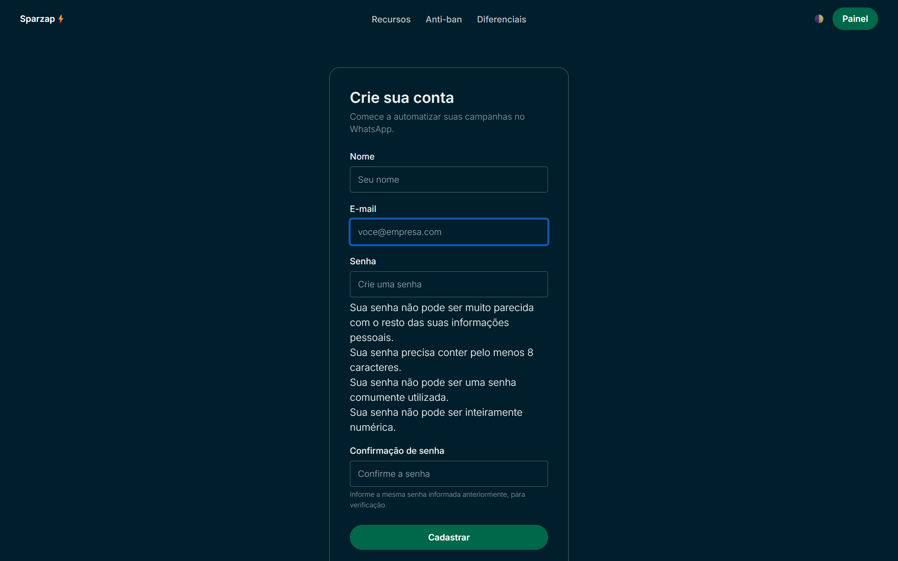

> Seu **login é o e-mail** (não existe nome de usuário). A senha precisa ter
> pelo menos 8 caracteres e não pode ser óbvia demais — o sistema recusa
> senhas comuns como "12345678".

Depois de criar a conta você já entra direto. Nas próximas vezes, use a tela
de entrada:


**Esqueceu a senha?** Clique em "Esqueci minha senha" e siga o e-mail que
você receber.

---

## 4. Conhecendo a tela

Todas as telas seguem o mesmo formato:

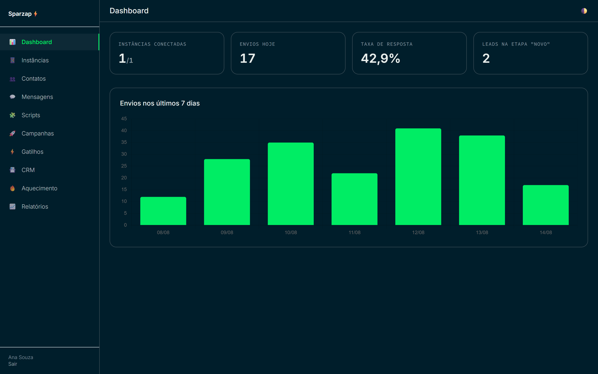

- **Menu lateral (esquerda)** — todos os módulos do sistema. O item onde você
  está fica destacado em verde.
- **Topo** — o nome da tela e os botões de ação daquela página.
- **Centro** — o conteúdo.
- **Canto inferior esquerdo** — seu nome e o link **Sair**.

O **Dashboard** (primeira tela após entrar) mostra o resumo do seu dia:

| Indicador | O que significa |
|---|---|
| **Instâncias conectadas** | Quantos números seus estão funcionando agora |
| **Envios hoje** | Total de mensagens enviadas hoje, somando todos os números |
| **Taxa de resposta** | De quem recebeu, quantos responderam |
| **Leads na etapa "Novo"** | Interessados que ainda não foram atendidos |

Abaixo, o gráfico mostra os envios dos últimos 7 dias.

### Tema claro e escuro

O botão 🌓 no canto superior direito alterna entre o tema escuro (padrão) e
o claro. Sua escolha fica salva no navegador.

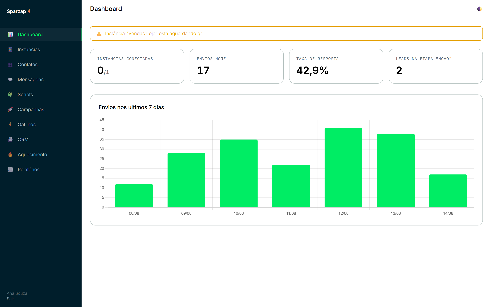

### No celular

O sistema funciona no celular. O layout se adapta à tela menor:

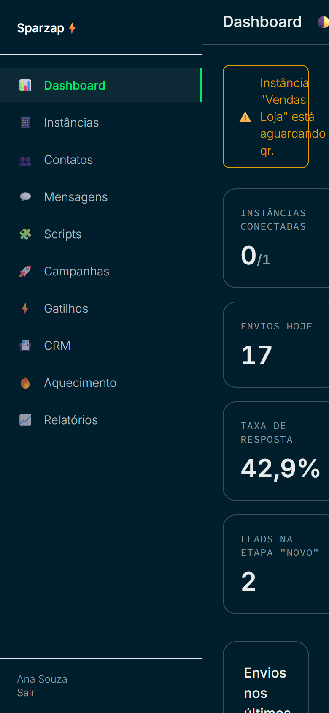

---

## 5. Passo 1 — Conectar seu WhatsApp

No Sparzap, cada número de WhatsApp é chamado de **instância**. Você pode ter
vários.

Vá em **Instâncias** no menu lateral:

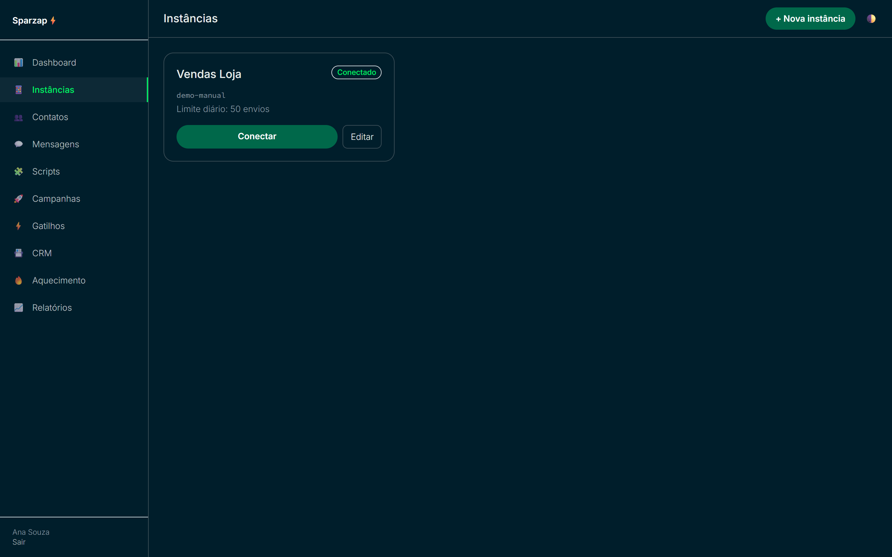

Clique em **Nova instância**:

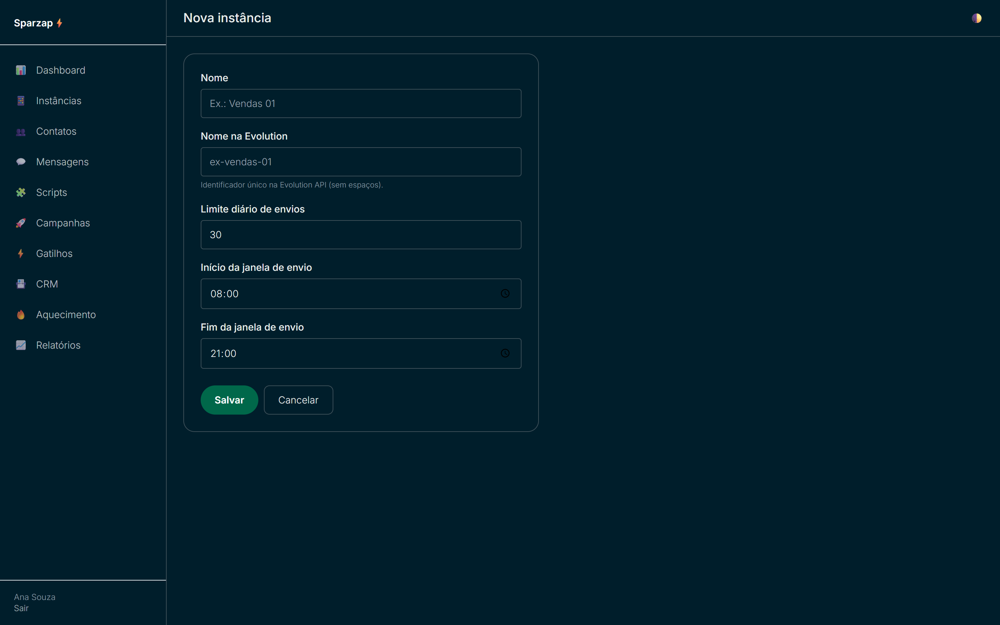

Preencha:

| Campo | O que colocar |
|---|---|
| **Nome** | Um apelido para você se achar. Ex.: "Vendas Loja", "Atendimento" |
| **Nome na Evolution** | Identificador técnico, sem espaços nem acentos. Ex.: `vendas-loja` |
| **Limite diário de envios** | Quantas mensagens no máximo por dia. **Comece com 30** |
| **Início / fim da janela** | O horário em que o sistema pode enviar. Ex.: 08:00 às 20:00 |

> **Por que a janela de horário importa:** ninguém manda promoção às 3 da
> manhã. Enviar de madrugada é um sinal claro de robô. Deixe num horário
> comercial.

### Escaneando o QR Code

Depois de salvar, o sistema mostra um QR Code:

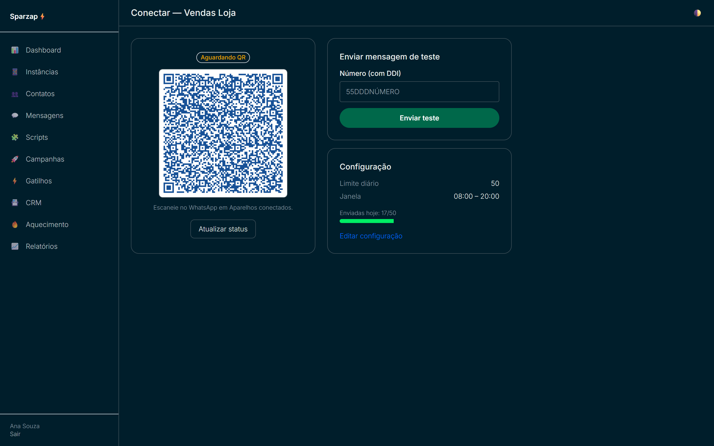

No seu **celular**:

1. Abra o WhatsApp
2. Toque nos três pontinhos (Android) ou em **Configurações** (iPhone)
3. Toque em **Aparelhos conectados**
4. Toque em **Conectar um aparelho**
5. Aponte a câmera para o QR Code da tela

Quando conectar, a etiqueta muda de **Aguardando QR** (laranja) para
**Conectado** (verde).

> **O QR expira em poucos segundos.** Se demorar, recarregue a página para
> gerar um novo.

> **Apareceu "Não é possível conectar novos dispositivos no momento"?**
> É uma limitação temporária do próprio WhatsApp. Espere um minuto, recarregue
> a página e tente de novo — costuma funcionar na segunda tentativa.

### Testando

Na mesma tela, use **Enviar mensagem de teste** com o seu número pessoal
(formato `55` + DDD + número, sem espaços). Se chegar no seu WhatsApp,
está tudo certo.

Nessa tela você também acompanha **Enviadas hoje** — quanto do seu limite
diário já foi usado.

---

## 6. Passo 2 — Aquecer o número

> ⚠️ **Este é o passo mais importante do manual.** Pular ele é a causa
> número um de números bloqueados.

Aquecer significa usar o número de forma crescente: poucas mensagens nos
primeiros dias, aumentando aos poucos até o volume normal. Isso faz o número
parecer o que ele deve parecer — uma pessoa usando o WhatsApp.

Vá em **Aquecimento**:

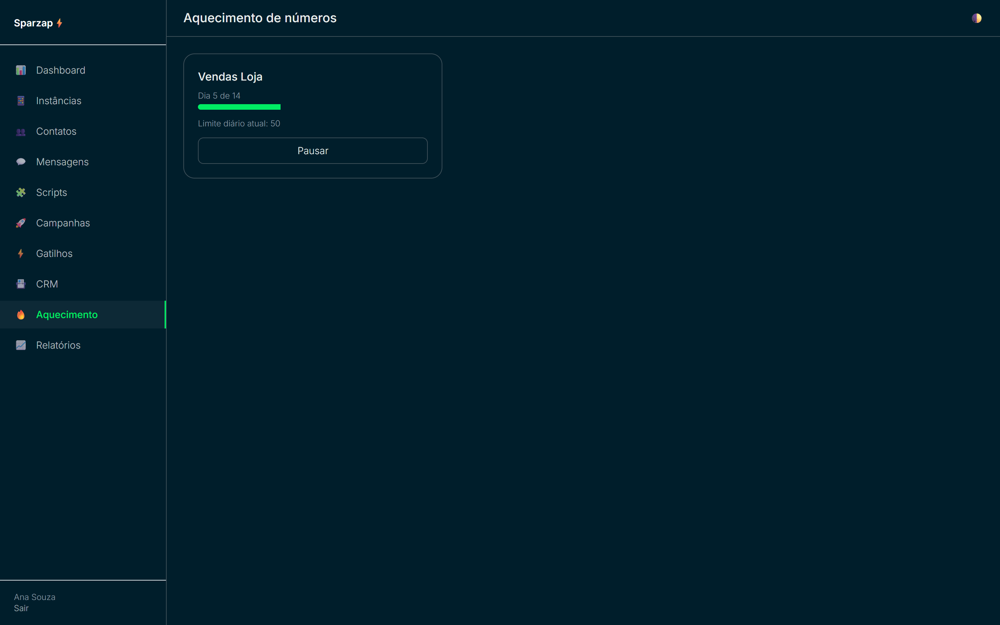

Escolha a instância e clique em **Iniciar aquecimento**. O plano padrão dura
**14 dias**.

**O que acontece:** o sistema começa liberando 5 mensagens por dia e vai
subindo um pouco a cada dia, até chegar no limite que você configurou. Você
não precisa fazer nada — ele ajusta sozinho, todo dia de madrugada.

Você pode **pausar** e **retomar** o plano quando quiser.

> Durante o aquecimento você **pode** criar campanhas normalmente. O sistema
> simplesmente não envia mais do que o limite do dia permite — o resto fica
> na fila para os dias seguintes.

---

## 7. Passo 3 — Cadastrar seus contatos

Vá em **Contatos**:

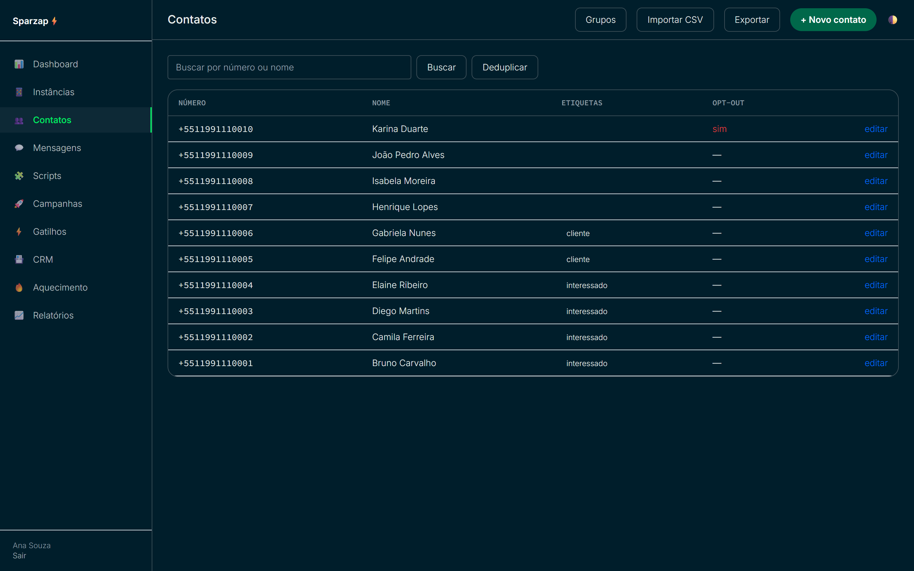

### Importando uma lista

O caminho mais rápido é importar uma planilha. Clique em **Importar CSV**:

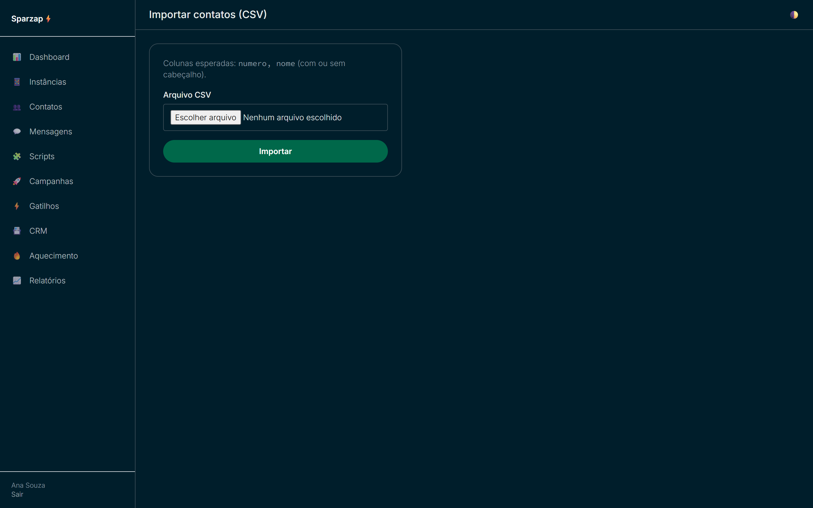

O arquivo precisa ser **.csv** com duas colunas: número e nome.

```
numero,nome
11988887777,Bruno Carvalho
(11) 99111-0002,Camila Ferreira
5511991110003,Diego Martins
```

> **Não se preocupe com o formato do número.** O sistema entende com ou sem
> DDI, com ou sem parênteses e traços, e adiciona o nono dígito quando falta.
> Todos viram o padrão `+5511988887777`.

Se você exporta do Excel, use **Salvar como → CSV (separado por vírgulas)**.

### Etiquetas e listas

- **Etiquetas** marcam características do contato ("interessado", "cliente").
  Um contato pode ter várias.
- **Listas** agrupam contatos por finalidade ("Clientes VIP").

Servem para você escolher depois quem vai receber cada campanha.

### Opt-out — quem pediu para não receber

Quando alguém pede para parar de receber, marque o contato como **opt-out**.
Ele passa a ser **automaticamente pulado em todas as campanhas**, para sempre.

Você pode marcar vários de uma vez selecionando na lista e usando a ação em
massa.

> Respeitar o opt-out não é só educação: é o que evita denúncias, e denúncia
> é o caminho mais rápido para o bloqueio.

### Removendo duplicados

O botão **Deduplicar** encontra o mesmo número cadastrado mais de uma vez
(comum depois de importar várias planilhas) e junta tudo num contato só,
preservando etiquetas e listas.

---

## 8. Passo 4 — Grupos

Se você administra grupos, o Sparzap consegue usá-los. Vá em
**Contatos → Grupos**:

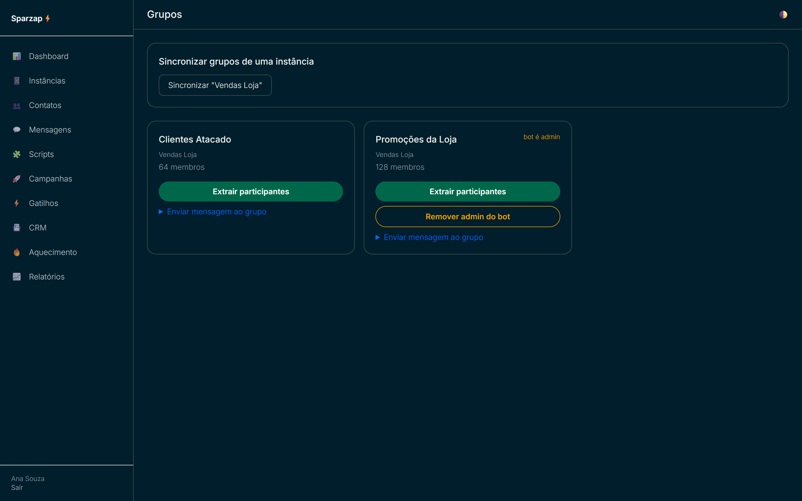

**Sincronizar grupos** busca no WhatsApp todos os grupos daquele número.

> ⏳ **Isso demora.** O WhatsApp devolve as informações de um grupo por vez —
> numa conta com muitos grupos a sincronização leva **1 a 2 minutos**. A
> página avisa que começou; recarregue depois de um tempo para ver o
> resultado.

Com os grupos na tela você pode:

| Ação | O que faz |
|---|---|
| **Extrair participantes** | Transforma os membros do grupo em contatos seus |
| **Enviar mensagem** | Manda uma mensagem para o grupo, com opção de marcar todos |
| **Remover admin** | Tira o **seu próprio número** da administração do grupo |

### Administradores nunca recebem disparo

Ao extrair participantes, o Sparzap **ignora os administradores do grupo** —
tanto os admins comuns quanto o dono do grupo (superadmin). Eles não são
cadastrados como contatos e, por consequência, **nunca entram no público de
uma campanha**.

Por isso é normal um grupo de 30 pessoas gerar 28 contatos: os dois admins
ficaram de fora.

> O Sparzap **não mexe na administração do grupo** para isso. Ninguém é
> rebaixado — os admins simplesmente não são coletados.

Se você já tinha extraído um grupo antes desta regra existir, **extraia de
novo**: a reextração remove os admins que haviam sido coletados.

### Para que serve "Remover admin"

Quando o bot é administrador do grupo, ele fica mais visível para o WhatsApp
e para os membros. Tirar a administração **antes de um disparo grande**
reduz o risco. Existe também uma opção na campanha para fazer isso
automaticamente.

---

## 9. Passo 5 — Escrever as mensagens

Antes de disparar, escreva o que vai ser dito. Vá em **Mensagens**:

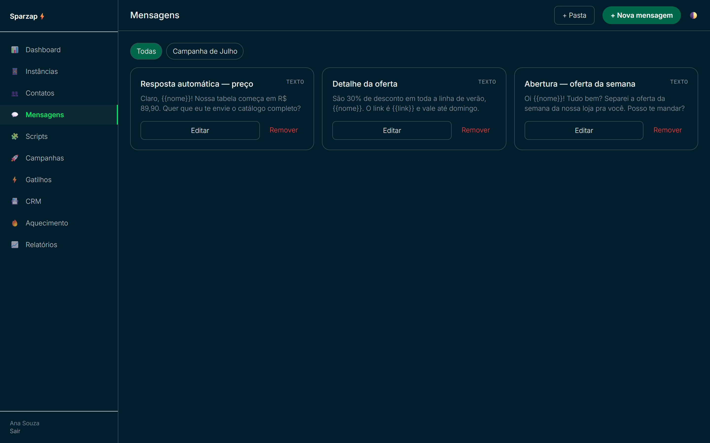

Clique em **Nova mensagem**:

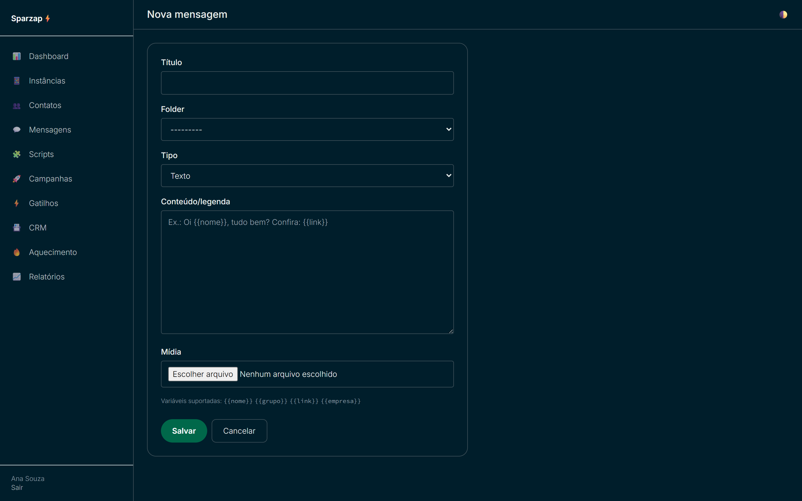

| Campo | Para quê |
|---|---|
| **Título** | Só para você achar depois. Ex.: "Abertura — oferta da semana" |
| **Pasta** | Organiza as mensagens por campanha ou tema (opcional) |
| **Tipo** | Texto, áudio, imagem, vídeo ou documento |
| **Conteúdo** | O texto que a pessoa vai receber |
| **Mídia** | O arquivo — **obrigatório** se o tipo não for texto |

### Personalizando com o nome da pessoa

Escreva `{{nome}}` no meio do texto e o sistema troca pelo nome de cada
contato na hora do envio:

```
Oi {{nome}}! Tudo bem? Separei a oferta da semana pra você.
```

O Bruno recebe "Oi Bruno Carvalho!" e a Camila recebe "Oi Camila Ferreira!".

Variáveis disponíveis:

| Variável | Vira |
|---|---|
| `{{nome}}` | O nome do contato |
| `{{grupo}}` | O grupo de onde o contato veio |
| `{{link}}` | Um link que você definir |
| `{{empresa}}` | O nome da sua empresa |

> Se você digitar uma variável que não existe, o sistema avisa ao salvar.

### Variações — o truque anti-robô

Mandar **exatamente o mesmo texto** para 200 pessoas é o padrão mais fácil de
detectar. Por isso você pode cadastrar **variações** da mesma mensagem:

- "Oi {{nome}}! Tudo bem? Separei a oferta da semana pra você."
- "Olá {{nome}}, boa tarde! Chegou a promoção da semana, quer ver?"
- "{{nome}}, tudo certo? Tenho uma novidade da loja pra te mostrar."

A cada envio o sistema **sorteia uma delas**. Cada pessoa recebe um texto
levemente diferente.

**Recomendação: escreva pelo menos 3 variações** de cada mensagem.

---

## 10. Passo 6 — Montar o script

Um **script** é a sequência do que vai acontecer. Vá em **Scripts** e clique
em **Novo script**:

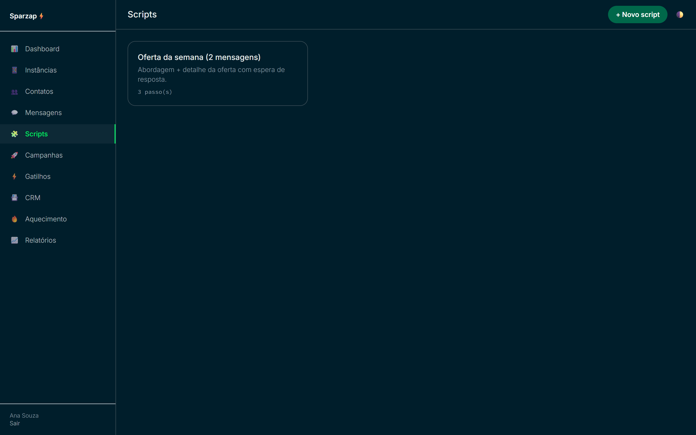

Depois de criar, você adiciona os **passos**:

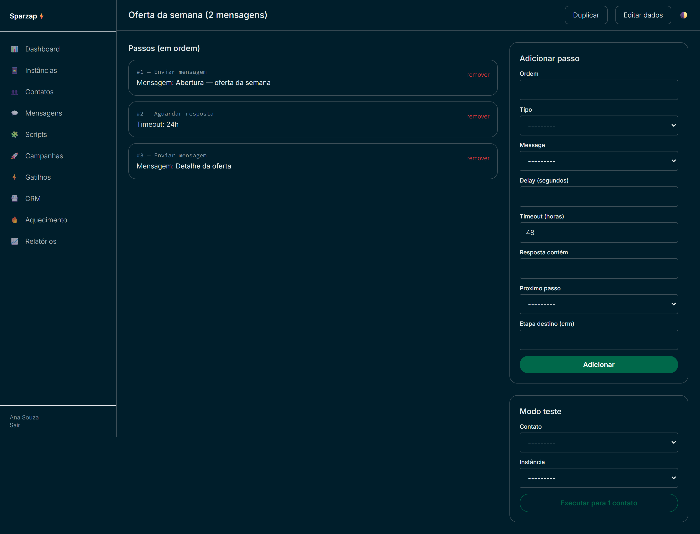

Tipos de passo:

| Tipo | O que faz |
|---|---|
| **Enviar mensagem** | Manda uma mensagem da sua biblioteca |
| **Aguardar (delay fixo)** | Espera X segundos antes do próximo passo |
| **Aguardar resposta** | Para e só continua quando a pessoa responder |
| **Condição** | Se a resposta contiver certos termos, **pula** para outro passo |
| **Mudar etapa do lead** | Move a pessoa no funil do CRM |

### Um script simples que funciona bem

```
1. Enviar mensagem  →  "Oi {{nome}}! Separei a oferta da semana. Posso mandar?"
2. Aguardar resposta (24 horas)
3. Enviar mensagem  →  "São 30% em toda a linha de verão. O link é {{link}}."
```

A lógica: você **pergunta antes de despejar** a oferta. Quem responde "pode"
está interessado de verdade — e quem não responde não recebe o resto.

> **Aguardar resposta** tem um prazo (padrão 48h). Se a pessoa não responder
> nesse tempo, o script segue para o próximo passo assim mesmo.

### Como a Condição realmente funciona

Esta é a parte que mais confunde, então leia com atenção.

**A condição só sabe *pular* passos à frente.** Ela não cria dois caminhos
separados. Quando os termos casam, o fluxo salta para o passo que você
escolheu; quando não casam, ele segue na ordem normal.

Isso significa que o desenho intuitivo **não funciona**:

```
1. Mensagem 1
2. Aguardar resposta
3. Condição "pode" → vai para o passo 4      ← não faz nada!
4. Mensagem 2
```

Aqui todo mundo recebe a mensagem 2: quem casou pula para o passo 4, e quem
não casou segue em ordem... e chega no passo 4 também.

**O jeito certo é inverter**: condicione nos termos **negativos** e faça a
condição *pular* a mensagem que você não quer enviar.

```
1. Mensagem 1     "Posso te mandar o convite do grupo?"
2. Aguardar resposta (24h)
3. Condição "nao, nao quero, sem interesse" → pula para o passo 5
4. Mensagem 2     (a oferta completa)
5. Despedida      (opcional)
```

Resultado: quem recusou pula direto para o passo 5 e não recebe a oferta;
quem aceitou passa pelo 4 normalmente.

**Vários termos, separados por vírgula.** A condição casa se *qualquer um*
aparecer. Maiúsculas e acentos são ignorados — `nao` encontra "Não", "NÃO"
e "nao".

> ⚠️ **Evite termos de 1 ou 2 letras.** A busca é por trecho, então um termo
> `n` casaria com "ma**n**dar". Prefira palavras inteiras.

> ⚠️ **Quem não responde é tratado como resposta positiva.** No fim do prazo,
> o texto avaliado é vazio, nenhum termo negativo casa, e o fluxo segue —
> enviando a mensagem 2 para quem te ignorou. Se isso não for o que você
> quer, deixe a mensagem 2 como último passo e não use a condição, ou trate
> esses contatos numa campanha separada.

### Testando antes de disparar

Use o botão **Testar** no script e informe um contato seu. Ele executa o
script inteiro só para essa pessoa. **Faça isso sempre antes de uma campanha
grande** — é como você descobre erro de digitação e variável errada.

---

## 11. Passo 7 — Disparar a campanha

Agora juntamos tudo. Vá em **Campanhas**:

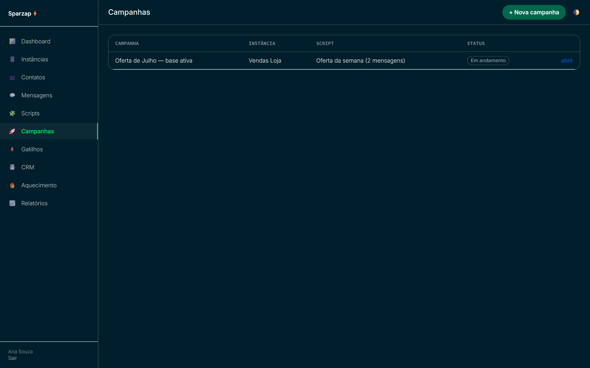

Clique em **Nova campanha**:

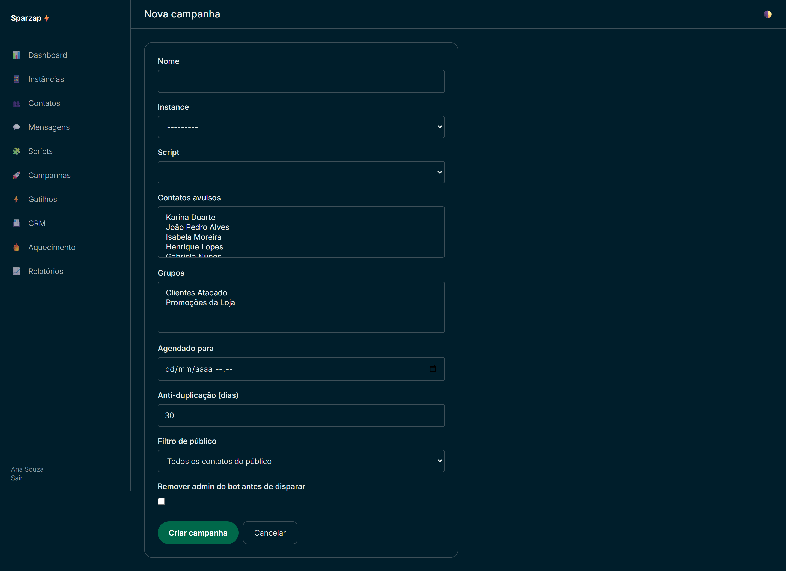

| Campo | O que escolher |
|---|---|
| **Nome** | Como você vai identificar. Ex.: "Oferta de Julho — base ativa" |
| **Instância** | Por qual número vai sair |
| **Script** | A sequência que você montou |
| **Contatos avulsos** | Contatos escolhidos um a um |
| **Grupos** | Todos os membros dos grupos escolhidos |
| **Filtro de público** | "Todos" ou "Somente quem ainda não respondeu" |
| **Anti-duplicação (dias)** | Não reenviar para quem já recebeu nos últimos X dias |
| **Revalidar administradores** | Reconsulta os grupos antes de enviar, garantindo que nenhum admin receba |

### Quando marcar "Revalidar administradores"

Administradores de grupo nunca recebem disparo do Sparzap — isso já é
garantido quando você extrai os participantes. Mas há uma brecha: se alguém
**virou admin depois** de você ter extraído o grupo, ele continua na sua
lista como membro comum.

Marcando essa opção, o sistema reconsulta os grupos no WhatsApp logo antes
do envio e tira do público quem for admin naquele momento. Também aproveita
para trazer quem entrou no grupo nesse meio-tempo.

Custa cerca de meio segundo por grupo. **Se a campanha usa grupos, deixe
marcado.**

> A opção também remove o **seu próprio número** da administração dos grupos
> onde ele for admin — medida anti-bloqueio, já que bot administrador chama
> mais atenção. Nenhum outro administrador é rebaixado.

### Entendendo os filtros

**Somente quem ainda não respondeu** é útil na segunda leva: você dispara
para a base toda, espera alguns dias, e faz uma nova campanha só para quem
ficou em silêncio — sem incomodar quem já respondeu.

**Anti-duplicação** evita o erro clássico de mandar a mesma promoção duas
vezes para a mesma pessoa. O padrão de 30 dias serve bem.

> Contatos marcados como **opt-out** são sempre removidos do público,
> independente de qualquer filtro.

### Acompanhando o disparo

Depois de clicar em **Iniciar**, a tela de detalhe mostra o andamento
**atualizando sozinho**, sem precisar recarregar:

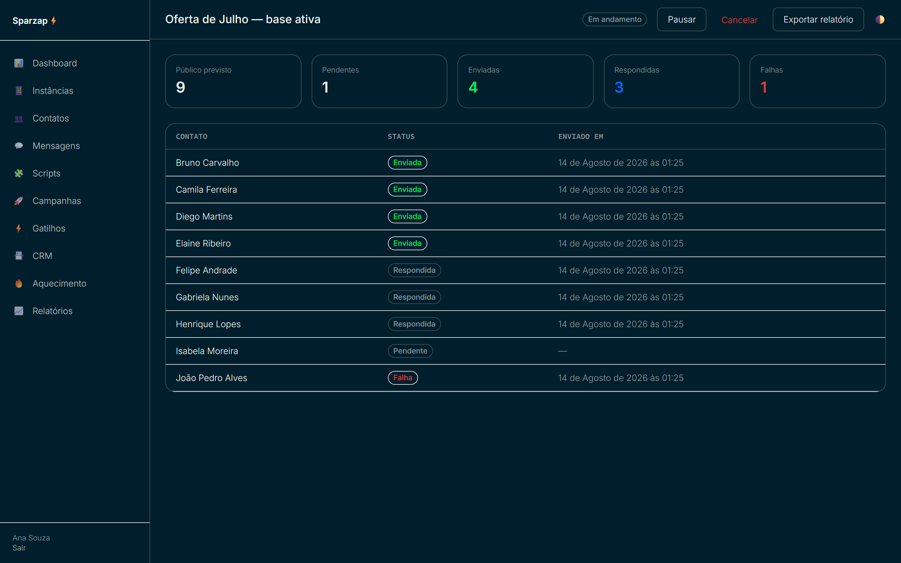

| Status | Significa |
|---|---|
| **Pendente** | Ainda na fila |
| **Enviada** | Mensagem entregue ao WhatsApp |
| **Respondida** | A pessoa respondeu 🎉 |
| **Falha** | Não deu certo — o motivo aparece na linha |
| **Pulada** | Removida por opt-out ou anti-duplicação |

Você pode **Pausar** a qualquer momento e **Retomar** depois — quem já
recebeu não recebe de novo. **Cancelar** encerra de vez.

**Exportar relatório** baixa uma planilha com todos os contatos e status.

> **Por que a campanha demora?** É de propósito. O sistema espera de 20 a 60
> segundos entre cada mensagem, com variação aleatória. Uma campanha para 100
> pessoas leva algumas horas. **Isso é o que protege seu número.**

---

## 12. Gatilhos: respostas automáticas

Um **gatilho** responde sozinho quando alguém escreve determinada palavra.
Vá em **Gatilhos**:

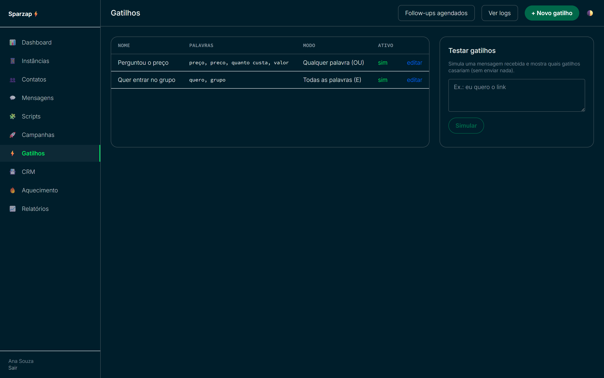

Clique em **Novo gatilho**:

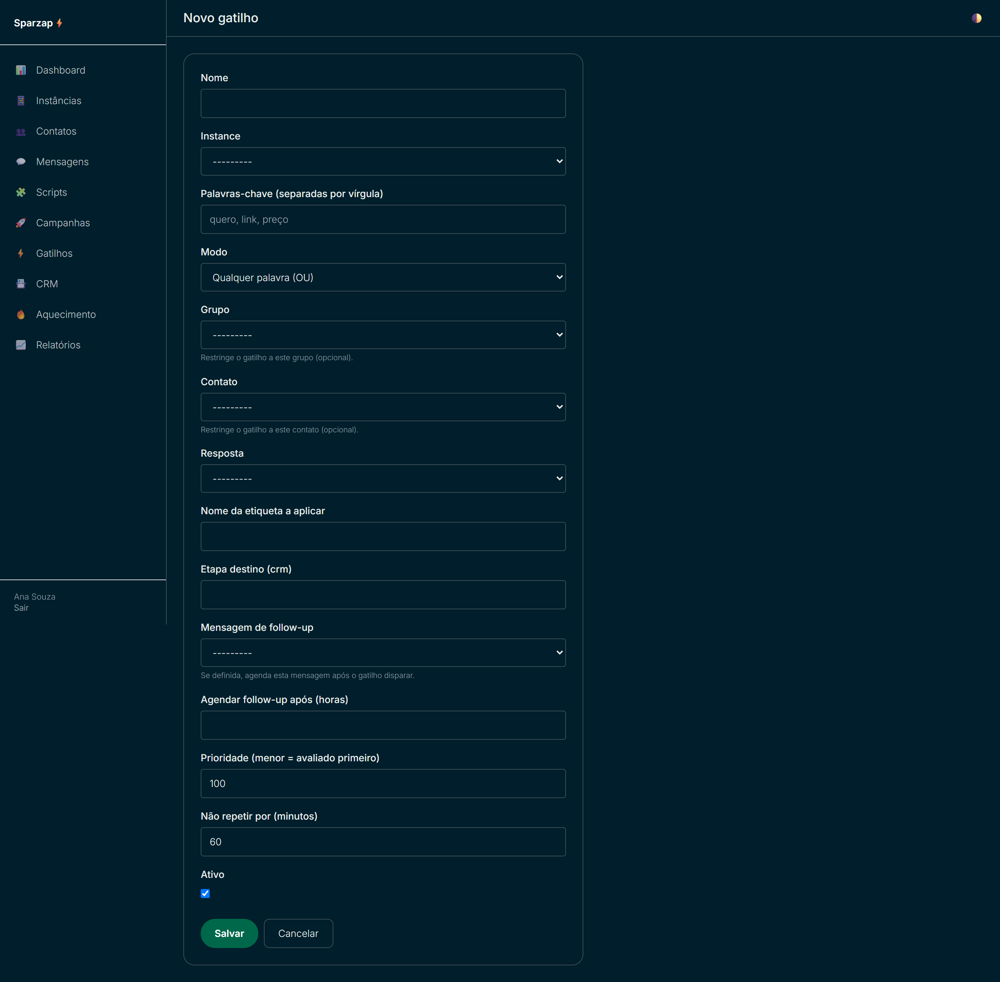

| Campo | Explicação |
|---|---|
| **Nome** | Para você identificar. Ex.: "Perguntou o preço" |
| **Instância** | Em qual número o gatilho funciona |
| **Palavras-chave** | Separadas por vírgula: `preço, preco, quanto custa, valor` |
| **Modo** | **Qualquer palavra (OU)** ou **Todas as palavras (E)** |
| **Resposta** | A mensagem que será enviada |
| **Etiqueta a aplicar** | Marca o contato automaticamente |
| **Etapa destino** | Move a pessoa no funil do CRM |
| **Follow-up** | Agenda outra mensagem para X horas depois |
| **Prioridade** | Menor número é avaliado primeiro |
| **Não repetir por (minutos)** | Evita responder a mesma pessoa em looping |

### OU vs E — a diferença

- **Modo OU** com `preço, valor`: responde se a pessoa escrever *qualquer uma*
  das duas.
- **Modo E** com `quero, grupo`: só responde se a mensagem tiver *as duas*
  palavras. Serve para ser mais específico.

### Prioridade

Se duas regras casarem com a mesma mensagem, vence a de **menor número**.
Coloque as regras específicas com prioridade baixa (10, 20) e as genéricas
com prioridade alta (100).

### Sempre escreva acentuado e sem acento

As pessoas digitam de tudo. Cadastre `preço, preco, preços, precos` para não
perder ninguém.

Em **Gatilhos → Logs** você vê tudo que os gatilhos já dispararam.

---

## 13. Mensagens agendadas

Serve para lembrar de alguém depois: "me chama semana que vem".

Vá em **Gatilhos → Agendadas**:

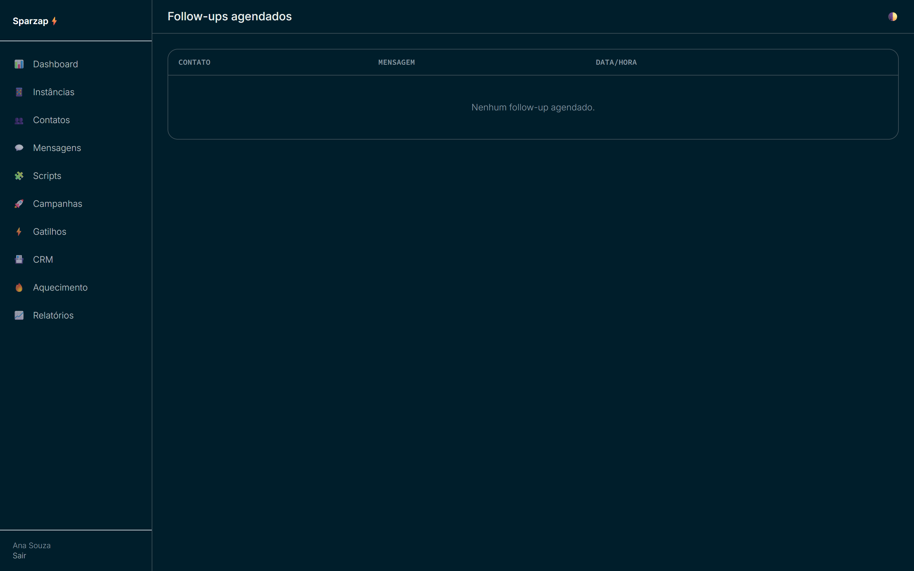

Você pode agendar manualmente ou deixar um gatilho agendar sozinho (o campo
**Follow-up** do gatilho). Cada agendamento pode ser **cancelado** ou
**reagendado** enquanto estiver pendente.

---

## 14. CRM: acompanhando seus leads

O CRM organiza os interessados por etapa da venda. Vá em **CRM**:

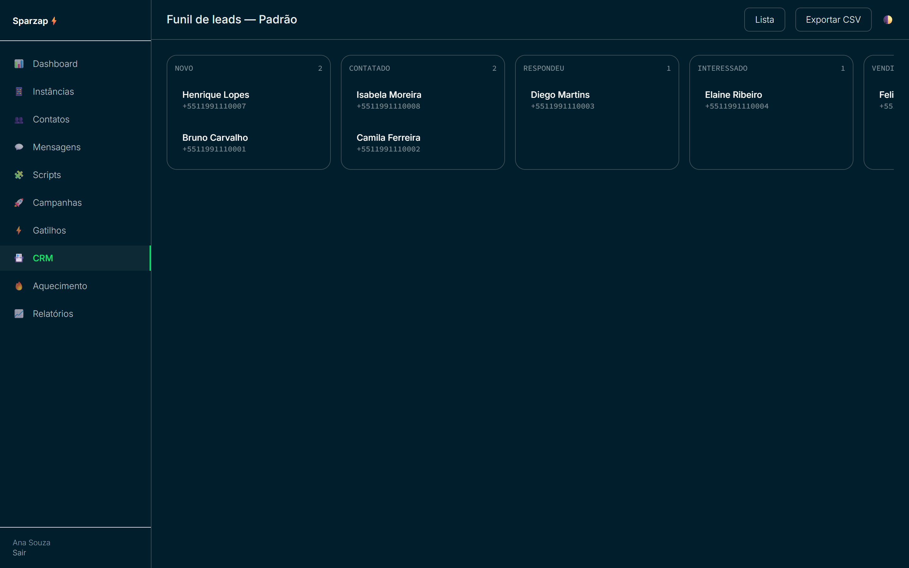

Cada coluna é uma etapa. As etapas padrão são:

**Novo → Contatado → Respondeu → Interessado → Vendido / Perdido**

Você move um lead arrastando ou pelo botão dentro do lead. Os scripts e
gatilhos também movem sozinhos, quando você configura o passo
"mudar etapa".

Para ver em formato de lista, use o botão **Lista**:

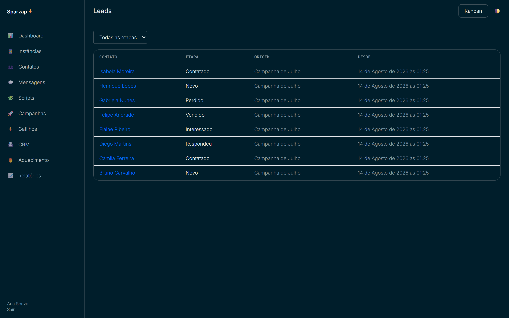

Clicando num lead você vê o **histórico completo da conversa** (o que foi
enviado e o que a pessoa respondeu) e pode escrever **anotações** —
"pediu para ligar depois das 18h", por exemplo.

---

## 15. Relatórios e backup

### Relatórios

Vá em **Relatórios**:

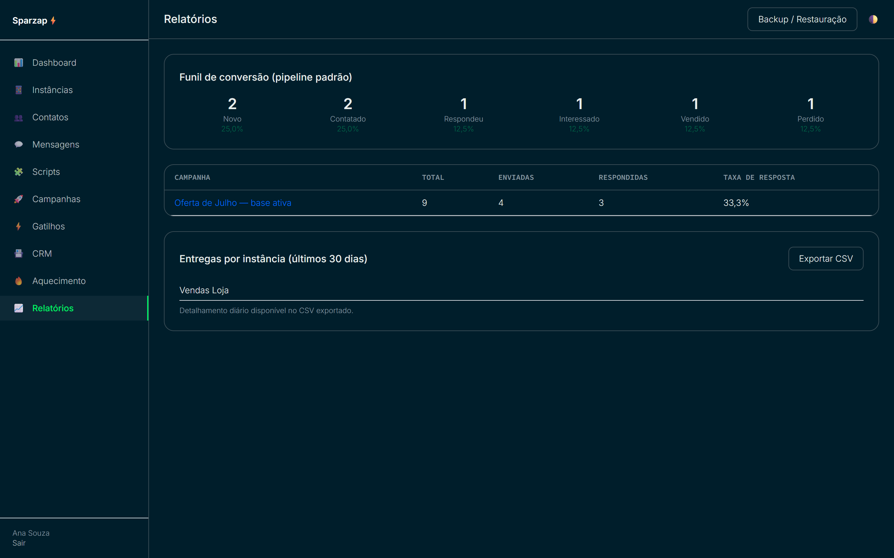

Aqui você exporta o histórico de entregas em planilha, para analisar no Excel
ou no Google Sheets.

### Backup da configuração

Em **Relatórios → Backup**:

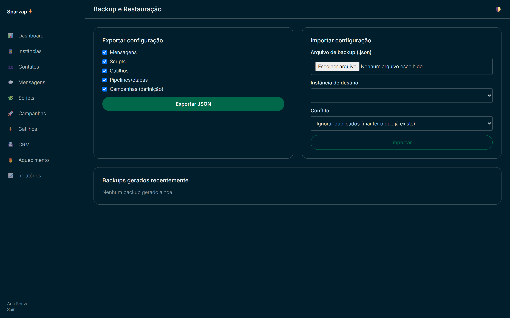

**Exportar** gera um arquivo com suas mensagens, scripts, gatilhos, funis e
campanhas. **Importar** restaura tudo a partir desse arquivo.

Serve para dois casos:

1. **Segurança** — guardar uma cópia do seu trabalho
2. **Replicar** — montar tudo numa conta e levar para outra

> O backup guarda a **configuração**, não os contatos nem o histórico de
> conversas. Para contatos, use **Contatos → Exportar CSV**.

---

## 16. Como não tomar bloqueio

O resumo do que realmente importa:

### Faça

- ✅ **Use chip dedicado**, nunca o número pessoal
- ✅ **Aqueça por 14 dias** antes do primeiro disparo grande
- ✅ **Comece com limite baixo** (30/dia) e suba devagar
- ✅ **Escreva 3+ variações** de cada mensagem
- ✅ **Envie em horário comercial** (janela de 08:00 às 20:00)
- ✅ **Respeite o opt-out** imediatamente
- ✅ **Pergunte antes de ofertar** — script de 2 etapas converte mais e
  incomoda menos
- ✅ **Teste o script** com o seu próprio número antes de disparar

### Não faça

- ❌ Disparar centenas de mensagens no primeiro dia
- ❌ Mandar o texto idêntico para todo mundo
- ❌ Enviar de madrugada
- ❌ Comprar lista de números
- ❌ Insistir com quem não respondeu duas vezes
- ❌ Ignorar quem pediu para parar

### Os sinais de alerta

Se você notar qualquer um destes, **pare os disparos e espere alguns dias**:

- A instância desconectou sozinha mais de uma vez
- Várias mensagens com status **Falha** na mesma campanha
- O sistema **pausou a instância automaticamente**
- Você recebeu aviso do WhatsApp no celular

> O Sparzap pausa a instância sozinho depois de 5 falhas seguidas. **Isso é
> proteção, não defeito.** Quando acontecer, investigue antes de reativar.

---

## 17. Solução de problemas

### "Não é possível conectar novos dispositivos no momento"

Limitação temporária do WhatsApp. Espere um minuto, recarregue a página e
escaneie o novo QR. Costuma funcionar na segunda tentativa.

### O QR Code não aparece / dá erro

O servidor não está conseguindo falar com o WhatsApp. Fale com quem
administra a instalação.

### Conectei no celular mas continua "Aguardando QR"

Clique em **Atualizar status** na tela de conexão. Se continuar errado depois
de alguns minutos, é problema de configuração do servidor — avise o
responsável técnico.

### A campanha não anda

Confira, nesta ordem:

1. A instância está **Conectada**?
2. Está dentro da **janela de horário** configurada?
3. O **limite diário** já foi atingido? (veja "Enviadas hoje" na tela da
   instância)
4. A campanha está **Em andamento** ou foi pausada?

Se o limite acabou, o resto sai automaticamente no dia seguinte.

### Sincronizar grupos não faz nada

Demora mesmo — 1 a 2 minutos numa conta com muitos grupos. Aguarde e
recarregue a página. Se aparecer mensagem de erro em vermelho, o WhatsApp
recusou a consulta; tente de novo mais tarde.

### Muitas mensagens com status "Falha"

Abra a campanha e leia o motivo em cada linha:

| Motivo | O que fazer |
|---|---|
| Número inexistente no WhatsApp | Limpe a lista — o número não tem conta |
| Instância desconectada | Reconecte o número e retome a campanha |
| Bloqueado pelo AntiBlock | Fora do horário ou limite atingido; aguarde |

### Os contatos importados ficaram errados

Confira se o CSV tem **duas colunas** (número e nome) e se está salvo como
CSV de verdade, não como Excel renomeado.

### Esqueci a senha

Use **Esqueci minha senha** na tela de entrada.

---

## 18. Glossário

| Termo | Significado |
|---|---|
| **Instância** | Um número de WhatsApp conectado ao sistema |
| **QR Code** | O código que você escaneia no celular para conectar |
| **Aquecimento** | Aumentar o volume de envios aos poucos, para não ser bloqueado |
| **Janela de operação** | O horário em que o sistema pode enviar |
| **Limite diário** | Máximo de mensagens por dia daquele número |
| **Script** | A sequência de passos de uma conversa |
| **Passo** | Uma ação dentro do script (enviar, esperar, condição...) |
| **Campanha** | Um disparo para muitas pessoas usando um script |
| **Público** | O conjunto de pessoas que vai receber a campanha |
| **Gatilho** | Regra que responde automaticamente a uma palavra-chave |
| **Lead** | Um contato dentro do funil de vendas |
| **Etapa** | A fase do lead no funil (Novo, Contatado, Vendido...) |
| **Opt-out** | Marcação de quem pediu para não receber mais |
| **Anti-duplicação** | Regra que impede reenviar para quem já recebeu |
| **Variação** | Texto alternativo da mesma mensagem, sorteado no envio |
| **Etiqueta** | Marcador que você aplica a um contato |
| **Instância pausada** | Número desativado, automaticamente ou por você |

---

## Precisa de mais?

- **Dúvida sobre a interface** — volte ao capítulo correspondente
- **Erro que não está aqui** — fale com quem administra a instalação
- **Documentação técnica** — [docs/README.md](README.md)
